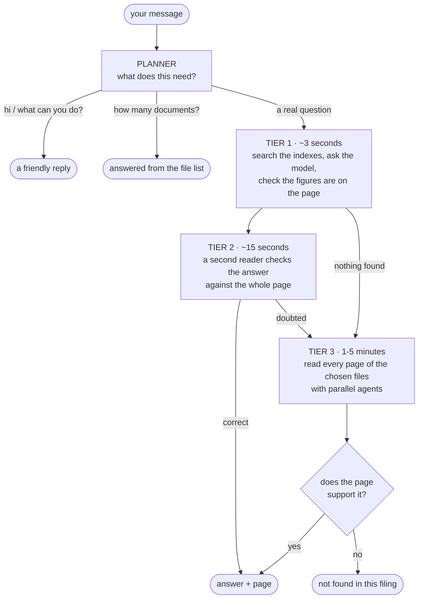

# Analyst Copilot

Question-answering over company filings, in whatever format the analyst has them.

- **▶ Live demo:** <https://analyst-copilot.technicalheist.com/>
- **One-page summary:** [docs/summary.txt](docs/summary.txt)
- **Plan (done vs remaining):** [PLAN.md](PLAN.md)
- **Implementation docs:** [docs/README.md](docs/README.md)
- **Challenge spec:** [AGENTS.md](AGENTS.md)

## What it does

You give it company filings. You ask a question in plain English. It answers with
the **document and page** the answer came from — or it tells you the filing does
not contain it.

It never shows a figure it cannot prove. That is the whole point: a wrong number
in a valuation is worse than no number.



We stop at the first tier that can prove its answer. Most questions never get
past tier 2.

### Why three tiers

Tier 1 only ever sees 5 pages. On the practice questions those 5 pages contain
the right page **58% of the time**. The other 42% are not hard questions — they
are impossible ones, because you cannot cite a page you were never shown.

Tier 3 removes that limit by reading everything. But reading more finds more
*wrong* answers too, so tier 2 sits in between to catch them.

### Things it does that are worth knowing

**It talks.** Type "hi" and you get a reply, not a search of a 10-K. Every message
is classified before anything is searched.

**It only reads the files it needs.** Ask about FY2018 in a set of three years and
it searches one document, not three. If that turns out to be wrong, it widens the
search rather than losing your answer.

**It can prove arithmetic.** An operating margin appears nowhere in a filing —
only the two figures behind it do. So a computed answer is checked by tracing
every input to its page and re-running the sum in Python. That unblocked 43
practice questions that were guaranteed refusals before.

**It shows its work.** Progress streams as it happens: which agent is running,
what it said it was looking for, which tool it called. Collapsed by default.

Full detail: **[what changed and what it measured](docs/17-enhancements.md)**.

### Supported formats

| Format          | Extensions              | Unit cited      | Boundary from                             |
| --------------- | ----------------------- | --------------- | ----------------------------------------- |
| PDF             | `.pdf`                  | page            | the file — pages are stored, not inferred |
| HTML            | `.htm` `.html` `.xhtml` | page            | `page-break: always` markers              |
| Word            | `.docx`                 | page or section | author page breaks; else headings         |
| Excel           | `.xlsx` `.xlsm`         | sheet           | one worksheet each; row blocks if large   |
| CSV             | `.csv` `.tsv`           | table           | the file; row blocks if large             |
| Markdown / text | `.md` `.txt`            | section         | whole file, chunked only if oversized     |

Every format is normalized to Markdown — tables stay tables, so a figure keeps
its year column — and stored one file per page under `storage/markdown/`.
A segment is only called a *page* when the source really has pages; a workbook
answer cites `sheet 'Q4 Revenue'`, not `page 4`. Details:
[docs/13-document-parsing.md](docs/13-document-parsing.md).

## Project layout

```text
large-documents-llm-system/
├── AGENTS.md
├── PLAN.md
├── docs/                     # Guides for completed layers
├── data/
│   ├── practice-questions.jsonl
│   └── questions-by-doc.json # [{doc_path, questions}]
├── filings/
├── scripts/examples/
├── ui/                       # React frontend
├── src/analyst_copilot/
│   ├── config/
│   ├── parsing/              # format detection, one parser per format,
│   │   ├── parsers/          #   all normalized to Markdown
│   │   └── markdown_store.py #   storage/markdown/{doc}/page-001.md
│   ├── embeddings/           # OpenAI-compatible /v1/embeddings
│   ├── llm/                  # OpenAI-compatible /v1/chat/completions
│   ├── retrieval/            # BM25, embeddings, blending
│   ├── agent/                # planner + the three tiers
│   │   ├── planner.py        #   what does this message need?
│   │   ├── cards.py          #   one line per document, from its filename
│   │   ├── corpus.py         #   pages on disk, split ≤10 per reader
│   │   ├── tools/            #   list, search, read, read_lines, calculate
│   │   ├── reader.py         #   one agent, one slice, strict brief
│   │   ├── orchestrator.py   #   fan out, then choose
│   │   ├── verification.py   #   proves a computed figure via its inputs
│   │   └── pipeline.py       #   the tiers, and the escapes
│   └── services/
│       ├── indexing/
│       └── qa/               # Retrieve → LLM → verify / abstain
├── storage/                  # Generated Markdown + indices (gitignored)
└── tests/
```

## Run it with Docker

Two containers — the API and an nginx-served UI — and one compose file.

```bash
cp .env.example .env          # then fill in the provider keys
docker compose -f docker-compose.yml up --build
```

The app is on <http://localhost:4006>. The API is **not** published to your
machine — the browser reaches it through nginx, same-origin. `docker compose up` without
`-f` instead brings up hot-reloading development servers. `filings/` and
`storage/` are mounted from your machine, so uploads and indexes survive the
containers.

⚠️ A `restart` reuses the existing images. After changing code use
`up --build -d`. Details: [docs/15-docker.md](docs/15-docker.md).

## The corpus is not in the repository

`filings/` is gitignored. It is 338 MB of 10-Ks that arrived with the challenge
zip — input data that never changes and that no commit should carry. The
directory is still where the code expects it (`settings.filings_dir`), and it
doubles as the destination for documents added through the UI.

**A fresh clone has to repopulate it** before the tests or the eval scripts
will run:

```bash
unzip analyst-copilot-data.zip          # gives filings/ and practice-questions.jsonl
```

The practice key itself (`data/practice-questions.jsonl`) *is* committed — it is
small, it is the scoring authority, and nothing in `scripts/eval/` runs without
it.

## Setup (without Docker)

```bash
python -m venv .venv
source .venv/bin/activate
pip install -r requirements.txt pytest
export PYTHONPATH=src
```

Copy environment variables into `.env` (not committed):

```env
# Chat LLM (QA pipeline)
OPENAI_URL=https://your-provider/v1/chat/completions
OPENAI_API_KEY=...
OPENAI_MODEL=...

# Embeddings (OpenAI-compatible, including Ollama at host/v1)
EMBEDDING_BASE_URL=http://localhost:11434/v1
EMBEDDING_API_KEY=ollama
EMBEDDING_MODEL=bge-m3

# Validator — the model that checks an answer in tier 2 (optional)
VALIDATOR_URL=
VALIDATOR_API_KEY=
VALIDATOR_MODEL=

# Flat price for the validator model, USD per million tokens. Optional.
# Unset means its tokens are counted but not priced — the same refusal to guess
# that applies to the chat model.
VALIDATOR_PRICE_INPUT=
VALIDATOR_PRICE_OUTPUT=
VALIDATOR_PRICE_CACHED_INPUT=
```

**Embedding URL resolution:** `EMBEDDING_BASE_URL` → `{OLLAMA_URL}/v1` → `{OPENAI_URL}` stripped to `/v1`.

Chat and embeddings use **separate** models and URLs. `OPENAI_MODEL` is not used for embeddings.

### The validator model

Tier 2 checks an answer that tier 1 wrote. That check is only worth running on a
**different** model. The same model has the same blind spot twice: on the
practice key it re-derived its own wrong formula, confirmed the arithmetic, and
passed 9 of 11 wrong answers.

| Variable            | Effect when set                   | Effect when blank                                   |
| ------------------- | --------------------------------- | --------------------------------------------------- |
| `VALIDATOR_MODEL`   | Checking runs on this model       | Checking runs on `OPENAI_MODEL` — no second opinion |
| `VALIDATOR_URL`     | Provider endpoint for the checker | Falls back to `OPENAI_URL`                          |
| `VALIDATOR_API_KEY` | Key for that endpoint             | Falls back to `OPENAI_API_KEY`                      |

So a checker on the same gateway needs only `VALIDATOR_MODEL`. The model **must
support tool calling** — the checker finishes by calling `report_validation`.
Naming the answering model here counts as unset, not as a second opinion.

The three `VALIDATOR_PRICE_*` rates are USD per million tokens, flat (no peak
tier). Leave them unset and the checker's tokens are still counted, just not
priced — the same refusal to guess a gateway's margin that applies to
`CHAT_PRICE_*`. `VALIDATOR_PRICE_CACHED_INPUT` covers input the provider served
from its own cache.

`GET /api/v1/health` reports the validator model in use, so you can confirm the
setting took.

## Ask one question

Ask through the API. That is the only entry point that runs the whole system —
the planner, the three tiers, and the verifier. Start the server first:

```bash
python scripts/serve_api.py          # http://127.0.0.1:8000
```

Upload the filing if it is not indexed yet. The upload returns `202` and a job;
poll the status until it reads `ready`.

```bash
curl -X POST http://127.0.0.1:8000/api/v1/filings -F "file=@filings/3M_2018_10K.htm"
curl http://127.0.0.1:8000/api/v1/filings/3M_2018_10K/status
```

Then ask:

```bash
curl -X POST http://127.0.0.1:8000/api/v1/chat -H 'Content-Type: application/json' \
  -d '{"doc_name": "3M_2018_10K", "question": "What is the FY2018 capital expenditure amount for 3M?"}'
```

The reply carries the answer, the document and page it came from, and what the
run cost. Send `collection` instead of `doc_name` to ask a whole filing. Tier 3
can take minutes, so use `/api/v1/chat/stream` for the same answer with progress
events in front of it.

There is no bulk-indexing step. Every entry point indexes what it needs on
demand — `QuestionAnsweringService` builds a document's indices the first time
a question is asked of it, and the API does the same per upload, reporting
progress against the spec's 10-minute budget as it goes.

## Run all questions (index each filing if needed)

```bash
python scripts/examples/run_all_questions.py
python scripts/examples/run_all_questions.py --limit 5
```

Reads `data/questions-by-doc.json`. For each document it embeds if needed, answers that filing’s questions, and updates `data/questions-by-doc-results.json` after every question. Re-running skips questions that already have answers.

This is a tier-1 batch run, not the full harness — it calls the QA service
directly, the same as `ask.py` did. For a scored run of the whole system, use
`scripts/eval/run_practice.py` below.

## Run the API

```bash
python scripts/serve_api.py          # http://127.0.0.1:8000, interactive docs at /docs
```

| Method   | Path                                   | Purpose                                                                |
| -------- | -------------------------------------- | ---------------------------------------------------------------------- |
| `POST`   | `/api/v1/collections`                  | Create a filing                                                        |
| `POST`   | `/api/v1/collections/{name}/documents` | Add **many** documents to a filing at once                             |
| `GET`    | `/api/v1/collections/{name}/jobs`      | Indexing progress, one row per document                                |
| `POST`   | `/api/v1/filings`                      | Add a single filing (multipart upload) — returns `202` + a job to poll |
| `GET`    | `/api/v1/filings/{doc_name}/status`    | `queued → parsing → embedding → saving → ready` / `failed`             |
| `GET`    | `/api/v1/filings`                      | Filings the service can answer from                                    |
| `POST`   | `/api/v1/chat`                         | Ask one question of one **filing** (or one document)                   |
| `POST`   | `/api/v1/chat/stream`                  | The same answer, preceded by progress events (SSE)                     |
| `GET`    | `/api/v1/conversations`                | The caller's chat threads, newest first                                |
| `POST`   | `/api/v1/conversations`                | Start a thread (pinned to one filing)                                  |
| `GET`    | `/api/v1/conversations/{id}`           | A thread with all its messages                                         |
| `PATCH`  | `/api/v1/conversations/{id}`           | Rename a thread                                                        |
| `DELETE` | `/api/v1/conversations/{id}`           | Delete a thread and its messages                                       |
| `GET`    | `/api/v1/health`                       | Models in use, filings indexed                                         |

```bash
curl -X POST http://127.0.0.1:8000/api/v1/chat -H 'Content-Type: application/json' \
  -d '{"collection": "3M multi-year", "question": "What is the FY2018 capital expenditure?"}'
```

Chat history lives in **Postgres** (the `db` service in the compose stack), not
the browser. `POST /chat` accepts a `conversation_id` and records the question
and the verified answer — or the decline — in the thread; the response then
carries `message_id`, `user_message_id` and `latency_ms`. Without a database
configured, questions are still answered, just not recorded.

## Filings

A **filing** here is a named set of documents, not a single file: a question is
rarely about one file, so a question is asked of the whole filing. Retrieval
ranks pages from every indexed document in it against each other; the answer
still cites exactly one document.

The code calls these *collections* (`/api/v1/collections`) because "filing"
already means a single 10-K throughout the pipeline.

```bash
curl -X POST http://127.0.0.1:8000/api/v1/collections \
  -H 'Content-Type: application/json' -d '{"name": "3M multi-year"}'

curl -X POST "http://127.0.0.1:8000/api/v1/collections/3M%20multi-year/documents" \
  -F "files=@filings/3M_2018_10K.htm" -F "files=@filings/3M_2022_10K.htm"
```

Each filing is mirrored on both sides: originals under `filings/{name}/`,
Markdown and indices under `storage/{name}/` — one directory per filing, holding
`markdown/`, `bm25/` and `vector_indices/`. A filing is searchable as soon as
one of its documents is ready. Details:
[docs/14-collections.md](docs/14-collections.md).

## Run the UI

```bash
cd ui && npm install && npm run dev     # http://localhost:5173
```

Declining is a normal `200` with `"found": false` and `"evidence": null`, not an
error. Details: [docs/11-api.md](docs/11-api.md).

## Examples

Most of these exercise **one layer** and call it directly, for inspecting that
layer rather than for asking a question. `qa_example.py`, `ask.py` and
`run_all_questions.py` stop at tier 1: they never run the planner, the checker
or the reader agents. To ask a real question, use the API above.
`run_practice.py` is the exception — it runs the full harness.

```bash
PYTHONPATH=src python scripts/examples/parse_filing_example.py
PYTHONPATH=src python scripts/examples/embedding_example.py
PYTHONPATH=src python scripts/examples/bm25_search_example.py
PYTHONPATH=src python scripts/examples/hybrid_search_example.py
PYTHONPATH=src python scripts/examples/hybrid_search_full_filing.py
PYTHONPATH=src python scripts/examples/qa_example.py
PYTHONPATH=src python scripts/examples/ask.py filings/3M_2018_10K.htm "What is FY2018 capex?"
PYTHONPATH=src python scripts/examples/build_questions_by_doc.py
PYTHONPATH=src python scripts/eval/run_practice.py --limit 5
```

`qa_example.py` loads (or builds) indices for `3M_2018_10K`, runs hybrid search, calls the chat model once, and prints the verified answer plus page — or **not found in this filing**. That single pass is tier 1.

## Evaluate and score

Produce answers (writes after every question, safe to interrupt):

```bash
PYTHONPATH=src python scripts/eval/run_practice.py                  # all 136, full harness
PYTHONPATH=src python scripts/eval/run_practice.py --limit 10
PYTHONPATH=src python scripts/eval/run_practice.py --fast-only      # tier 1 alone
```

`--fast-only` runs the retrieval pipeline by itself. That is the +7 baseline, and
it is what any harness gain has to be measured against — the runner prints which
tier answered each question so a score change can be attributed.

Grade them against the practice key using the challenge rubric
(+1 correct answer *and* location, 0 abstain, 0 right answer wrong page, −1 confidently wrong):

```bash
PYTHONPATH=src python scripts/eval/score.py --results data/eval-results.json
PYTHONPATH=src python scripts/eval/score.py --results data/eval-results.json --judge
```

Bare figures are checked arithmetically with scale-aware tolerance; prose answers
need `--judge` or they are reported as `unjudged` rather than counted as wrong.
Details: [docs/10-evaluation.md](docs/10-evaluation.md).

```bash
PYTHONPATH=src pytest
```

## How a question is answered

**1. Plan it.** One decision first: is this small talk, a question about the file
list, or a real question? And if real, which files could hold the answer? It also
rewrites follow-ups so they stand alone — "and the year before?" becomes a full
question.

Every branch has a way out, so a wrong guess costs seconds, not your answer. A
chat reply can say "this needs the document". A scoped search that finds nothing
widens. [Details](docs/19-planner-agent.md).

**2. Split it.** A message asking several things becomes several questions, each
searched and **cited separately**. The parts are joined in code, not by a model —
a model asked to merge answers rewrites their figures.

**3. Tier 1.** Search the indexes, take the top 5 pages, ask the model for JSON,
then verify **evidence first**: score every retrieved page for whether it supports
the answer, and cite the page that actually does. The page the model named is a
hint. Figures are compared by significant digits, so a filing printed in millions
supports an answer given in billions.

**4. Tier 2.** A reader that did not write the answer sees the question, the
answer, and the *whole* cited page. It catches what digit-checking cannot: the
right figure for the wrong year, a segment instead of the total, half of a
two-part question.

**5. Tier 3.** If tier 1 found nothing or tier 2 doubted it, the chosen files are
split into slices of ten pages, one reader agent per slice, eight at a time.
Readers may read **only** their own pages, so together they cover everything and
no two can claim the same page. A senior agent then picks which candidate to
cite.

**6. Verify, always.** The verifier is the last word on both answering tiers.
Agents propose. It decides.

**7. Otherwise refuse:** *not found in this filing.*

### Flexible location, strict evidence

The page number is the least reliable link in the chain: the same document paginates differently as filed HTML and as the filer's own PDF, and 15 of 62 documents in the practice corpus disagree by one or two pages between the two. So verification finds the page and reports what it did:

| `location_match` | Meaning                                                                    |
| ---------------- | -------------------------------------------------------------------------- |
| `exact`          | The model's page carries the evidence                                      |
| `adjusted`       | A page within `evidence_page_tolerance` (2) does; the citation moved there |
| `relocated`      | A distant page carries the quote verbatim; the citation moved there        |
| `inferred`       | The model named no page; the best-supported one was used                   |

This does not loosen the guard against a wrong answer. An answer is still only ever attached to a page whose own text supports its figures — the change is that the system looks for that page instead of requiring the model to guess its number. Re-anchoring moves a citation; it never changes an answer.

Details: [docs/09-qa-pipeline.md](docs/09-qa-pipeline.md).

## HTML parsing strategy

SEC HTML is split on `page-break-after: always` or `page-break-before: always`, matched on `<hr>`, `<p>` or `<div>`. `<hr>` accounts for 76 of the 79 filings; matching only `<p>` sent nearly the whole corpus down the fallback path. Each segment becomes one page of plain text. Only 3 filings — short 8-Ks with no page-break markers at all — fall back to fixed-size chunks.

Citations use the 0-based `page_index`, which matches the practice key's `evidence_page_num` (74% exact, 91% within ±1). Printed footer numbers are parsed but not cited — they disagree with gold in both directions. See [docs/03-html-parsing.md](docs/03-html-parsing.md).

Indices record `PARSER_VERSION`, so a parsing change makes stale indices report as absent and they rebuild automatically instead of being silently reused.
