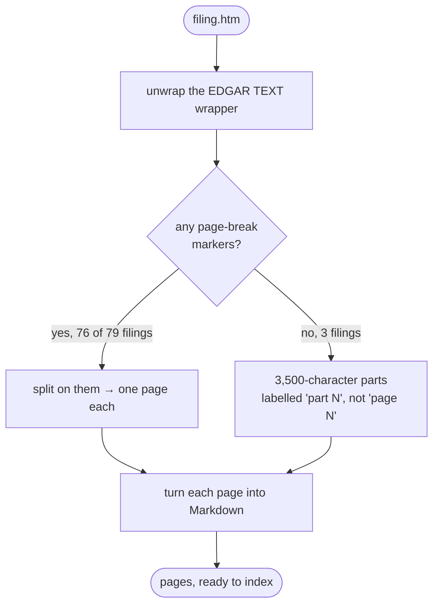

# Reading SEC HTML

**Code:** [`parsing/parsers/html.py`](../src/analyst_copilot/parsing/parsers/html.py)

Every answer has to name a page. HTML has no pages. This is how we get them back.

For the other formats — PDF, Word, Excel, CSV — see [reading
documents](13-document-parsing.md).

---

## Where the pages come from

SEC filings are a paginated document printed to HTML. The original page breaks
survive as CSS markers:

```html
<hr style="page-break-after: always">
```

So we split on those. **The pages are recovered, not invented.** A filing with no
markers falls back to fixed-size chunks, and we label those "part 1", "part 2"
rather than pretending they are pages.



## Tables survive as tables

This is the most important thing the parser does.

A 10-K's answer is usually a line item in a financial statement. Flattened to
prose, this:

```
Purchases of PP&E (1,577) (1,373) (1,420)
```

loses which figure belongs to which year. So data tables become Markdown tables,
and the row label stays attached to its columns.

Filers nest tables for layout, so tables are converted innermost-first. A table
with one column is a layout wrapper, not data, and gets unwrapped instead of
filling the page with pipes. Empty spacer columns are dropped — a statement with
three year columns often arrives as eleven.

## The bug that mattered most

The split pattern originally matched only `<p ... page-break-after>`. Across the
corpus:

| Marker | Filings |
|---|---:|
| `<hr style="page-break-after">` | 74 |
| `<hr style="page-break-before">` | 2 |
| `<p style="page-break-after">` | 1 |

That one `<p>` filing was the file the parser was developed against. So **78 of
79 filings silently fell back to character chunking.**

The damage: every citation was a 3,500-character slice number instead of a page,
so a correct location was permanently out of reach. Worse, chunks cut tables
mid-row, so a balance sheet line item could land in a different chunk from its
own header.

Matching `<hr>` and `<div>` too, and accepting `break-before`, brought the
fallback count from 78 down to 3. Those 3 are short 8-Ks with genuinely no
markers.

`tests/test_parsing.py` guards both the tag list and the corpus-wide ratio, so
this cannot come back quietly.

## Which page number gets cited

Each page has two numbers:

- **`page_index`** — its position in the file, counting from 0
- **`printed_page`** — the number printed in the footer, when we can find one

We cite `page_index`. Measured against the answer key over 141 evidence blocks:

| Using | Agrees with the key |
|---|---|
| `page_index` | **77% exact, 92% within ±1** |
| `printed_page` | off by +1 on 50 blocks, −1 on 44 — no pattern |

Printed footers are unreliable because the page-break marker sits *before* the
footer in some filings and *after* it in others. So the same footer number
attaches to different pages depending on the filer.

We still parse and store `printed_page`. We just never cite it.

## Indexes rebuild when parsing changes

`PARSER_VERSION` is stamped into every saved index. Change how pages are cut,
bump the version, and old indexes report as missing rather than being reused.

Without it a parsing fix would be invisible — the code would be right and the
stored pages would still be wrong.

## Demo and tests

```bash
PYTHONPATH=src python scripts/examples/parse_filing_example.py
PYTHONPATH=src pytest tests/test_parsing.py
```
