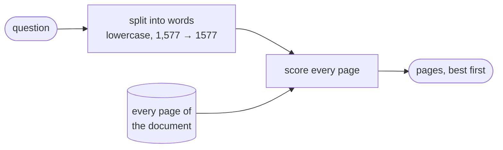

# Word search (BM25)

**Code:** [`retrieval/bm25/`](../src/analyst_copilot/retrieval/bm25/)

Finds pages containing the words you searched for. Uses `rank-bm25`.



## Parts

| File | Job |
|---|---|
| `tokenization.py` | Lowercase, strip commas inside numbers, keep letters and digits |
| `bm25/index.py` | The index: pages, tokens, model |
| `bm25/builder.py` | Build one from a parsed document |
| `bm25/searcher.py` | Search it |
| `bm25/storage.py` | Save and load under `storage/bm25/{doc}/` |

## The comma rule

The tokenizer turns `1,577` into `1577`.

Without that, a filing's `1,577` and a question's `1577` are different words and
never match. It is one line of code and it is the difference between finding a
figure and not.

## What it is good and bad at

**Good:** exact strings. Line item names, tickers, defined terms like
`1.500% Notes due 2026`. A meaning-based search has no reliable way to find those.

**Bad:** page length. BM25 divides by document length, and our "documents" are
pages running from 200 to 47,000 characters. A long page gets heavily penalised.

## What it is actually worth here

Measured over all 136 practice questions, how often the right page is in the top
5 results:

| | Right page in top 5 |
|---|---:|
| BM25 alone | **16.2%** |
| Embeddings alone | **58.1%** |

BM25 uniquely finds 5 questions that embeddings miss, and blending converts only
1 of them. So it is kept at a weight of **0.1** rather than removed.

**That is not a verdict on word search.** It is a verdict on word search *over
whole pages*, which is the setup that penalises it most. Splitting pages into
smaller chunks would change this number, and the weight should be re-measured
then — not before.

Full analysis: [document retrieval](07-hybrid-retrieval.md).

## Demo and tests

```bash
PYTHONPATH=src python scripts/examples/bm25_search_example.py
PYTHONPATH=src pytest tests/test_bm25.py
```
