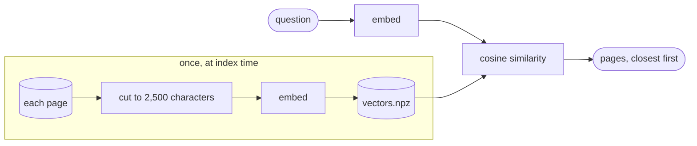

# Meaning search (embeddings)

**Code:** [`retrieval/vector/`](../src/analyst_copilot/retrieval/vector/)

Turns each page into a vector, turns your question into a vector, and finds the
closest pages. Good at questions that share no words with the answer.



## Parts

| File | Job |
|---|---|
| `text.py` | Cut page text to the embedding limit |
| `similarity.py` | Cosine similarity |
| `index.py` | The index: pages, vectors, metadata |
| `builder.py` | Embed every page |
| `searcher.py` | Embed the question, rank the pages |
| `storage.py` | `vectors.npz`, `pages.json`, `metadata.json` under `storage/vector_indices/{doc}/` |

The metadata records which embedding model built the index, so a model change is
detected instead of silently searching a mismatched vector space.

## What it is good and bad at

**Good:** paraphrase. "Is this business capital-intensive?" finds a
capital-spending table that shares no words with the question.

**Bad:** it only reads the first 2,500 characters of each page.

## The truncation limit

Only the first `retrieval_max_chars_per_page` characters of a page are embedded.
BM25 reads the whole page, so on a long page the two searches are working from
different amounts of text.

Measured across 20 filings and 2,252 pages: **73% of pages are longer than the
limit.** Of the right-answer evidence we could locate, about **13% starts after
the cut**.

The worst case in the corpus:

```
3M_2023Q2_10Q, page 1
  47,221 characters long
   2,500 embedded
  the answer sits at character 45,234
```

Meaning search could never find that. Neither could BM25, diluted across 47,000
characters of cover page.

**Two things make this survivable.** The API reports `embedded_chars` and
`truncated` on every page, so the UI draws the boundary rather than hiding it.
And tier 3's reader agents read the stored Markdown, not this index, so they see
whole pages — which is how that exact question is answered today.

The real fix is splitting pages into smaller chunks. Raising the limit is not a
fix, because real pages exceed any safe limit.

## Speed

Indexing a 130-page 10-K takes one to two minutes against a remote embedding
server. That is inside the 10-minute budget for adding a filing.

Cosine similarity is currently pure Python. On a 134-page document one query
takes about 45 ms, against about 1 ms with numpy — a 39× difference. It is not
the bottleneck (the model call dominates) but it is free to fix.

Full analysis: [document retrieval](07-hybrid-retrieval.md).
