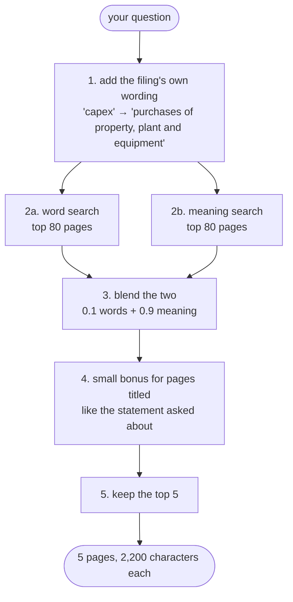

# Finding the right page

**Code:** [`retrieval/hybrid/`](../src/analyst_copilot/retrieval/hybrid/) ·
**Entry point:** `HybridSearcher.search`

How a question becomes the five pages the model is allowed to read.

---

## Why this decides the score

The scoring rule pays **+1 only for a correct answer with a correct page**. A
page can only be cited if it was found in the first place.

So one number sets a ceiling on everything: **how often the right page is in the
top 5 results.** No prompt, model or verifier can recover a page that was never
retrieved.

Measured against the answer key, that number is **58%**.

That is the number tier 3 exists to get around — see [the
harness](16-agent-harness.md).

---

## The pipeline



---

## Step 1 — say it the way the filing says it

You ask for "capex". The filing says *Purchases of property, plant and
equipment*. Word search matches literal words, so the two never meet.

So we append the filing's wording:

| You say | We also search for |
|---|---|
| capex, capital expenditure | purchases of property plant and equipment, pp&e, capital spending |
| cash flow statement | consolidated statement of cash flows, cash flows from investing |
| balance sheet | consolidated balance sheet, statement of financial position |
| income statement, net sales | consolidated statement of income, statement of operations |
| effective tax rate | provision for income taxes, income tax expense |

Measured: this lifts word search from **0 out of 10 to 2 out of 10** on the
diagnostic set, and leaves meaning search unchanged. It helps the search that
matches literal strings, which is what it was written for.

**Known weakness.** It appends *every* synonym of *every* matched group into one
string, which dilutes word-search scoring on long questions. Never properly
tested. Worth measuring before trusting it further.

The expanded question goes to both searches. The **original** question is what
step 4 reads, so expansion cannot trigger a bonus you did not ask for.

---

## Step 2 — two searches

Both are asked for 80 pages, not 5. Blending needs a deep pool: a page ranked
40th by one search and 2nd by the other should still be reachable.

- **[Word search](05-bm25-retrieval.md)** — exact strings. Scores 0 to ~50.
- **[Meaning search](06-vector-retrieval.md)** — paraphrase. Scores 0 to 1.

---

## Step 3 — blending them

The two score scales are not comparable. A word score of `48.91` against a
meaning score of `0.585` says nothing. Whichever scale is bigger would win
outright.

So each search's scores are squashed to 0–1 first, then added with weights:

```
final = 0.1 × word_score  +  0.9 × meaning_score
```

A page found by only one search still gets a partial score rather than being
dropped.

Real numbers, `3M_2018_10K`, "FY2018 capital expenditure":

| page | word | meaning | blended | rank |
|---:|---:|---:|---:|---:|
| 38 | 42.60 | 0.734 | 0.963 | #1 |
| 46 | 33.87 | 0.730 | 0.888 | #2 |
| 57 | 31.78 | 0.701 | 0.701 | #3 |
| 59 | 34.12 | 0.686 | 0.624 | #4 |
| 48 | **48.91** | 0.585 | **0.100** | **#5** |

Page 48 has the strongest word score of the five and finishes last. At 0.1 / 0.9
the word signal barely moves anything — which is exactly what the measurements
below argued for.

### The rank-based blending we switched off

There is a second way to blend, called RRF: ignore the scores and use only the
rank positions. `score = Σ 1 / (k + rank)`. It is immune to scale mismatch.

It is in the code and **switched off**. Here is why.

With `k = 60` over a pool of 80, every rank maps into the range `1/61 … 1/140`.
That is a 2.3× spread across the *entire* ranking. So RRF stopped behaving like a
ranking and started behaving like a head-count of searches — a page both searches
put at rank 15 beat a page one search was certain about at rank 1.

Worse, RRF weights the two searches **equally**. So the configured 45/55 split
was really about 48/52, and a search with 16% accuracy was getting half the vote
against one with 58%.

Tuning `k` to 10 or 20 did not fix it. Removing the term did.

**End to end, the score went from +1 to +7 across the 136 practice questions
when this was switched off.**

---

## Step 4 — the statement bonus

If your question names a financial statement, pages whose text contains that
statement's title get multiplied by 1.25.

| You mention | Pages boosted |
|---|---|
| cash flow, capex | *Consolidated Statement of Cash Flows* |
| balance sheet | *Consolidated Balance Sheet* |
| income statement, net income | *Consolidated Statement of Income / Operations* |

This is why a blended score can exceed 1.0 — the bonus is applied after
squashing.

**Honest note.** On the 136-question sweep this bonus changed **no** outcome.
Meaning-search-only and meaning-search-plus-bonus scored identically at every
setting tested. It is kept because it is cheap and targeted, but it is unproven
and a candidate for removal.

---

## Measured

How often the right page is in the top 5 (and top 10), over all 136 practice
questions. Computed with no model calls, by replaying stored scores through each
blending policy.

| Setup | Top 5 | Top 10 |
|---|---:|---:|
| Word search alone | 16.2% | 26.5% |
| **What used to ship** (RRF 0.6, words 0.45) | **36.0%** | 50.0% |
| Score-blending only, words 0.45 | 44.9% | 61.0% |
| Meaning search alone | 58.1% | 66.2% |
| **What ships now** (RRF off, words 0.1) | **58.1%** | 66.2% |
| Score-blending, words 0.2 | 58.1% | **66.9%** |
| A perfect chooser (impossible) | 61.8% | 73.5% |

Two conclusions the numbers force:

1. **The old blending destroyed a third of the retrieval it already had** — 36%
   against 58% for the meaning search inside it.
2. **Word search contributes about one question in 136.** It uniquely finds 5
   questions meaning search misses, and blending converts only 1. Kept at weight
   0.1 rather than removed, because this measurement is over whole pages — the
   setup that penalises it most.

---

## Known limits

### 1. Only part of each page is embedded

`retrieval_max_chars_per_page` is 2,500. Measured over 20 filings and 2,252
pages, **73% of pages are longer than that.** About 13% of the right-answer
evidence starts after the cut.

Worst case: `3M_2023Q2_10Q` page 1 is 47,221 characters, of which 2,500 were
embedded, with the answer at character 45,234.

**Tier 3 works around this** — reader agents read the stored Markdown, so they see
whole pages. So this now caps what tier 1 can answer *cheaply*, not what the
system can answer at all. Full details in [meaning
search](06-vector-retrieval.md).

The real fix is splitting pages into chunks and citing the parent page. Raising
the limit is not, because real pages exceed any safe limit.

### 2. Whole pages are unfair to word search

Scoring words over 47,000-character "documents" is not a fair test of word
search. Re-measure its weight after chunking lands, not before.

### 3. Searching several documents at once

A **filing set** searches all its documents together. Their scores are pooled
*before* squashing, because squashing per document would make every document's
best page score 1.0 and the merge would be ranked by nothing.

Meaning scores are comparable across documents by construction — same model, same
vector space. Word scores are **not**: their rarity weighting is computed within
one document. Pooling them is therefore approximate. It is done anyway, at weight
0.1, because the alternative loses exact line-item matching entirely. Worth
revisiting if that weight ever rises. See [filing sets](14-collections.md).

---

## Settings

All in [`config/settings.py`](../src/analyst_copilot/config/settings.py) and
listed in [configuration](02-configuration.md#retrieval).

Every one is an environment variable, so trying something needs no code change:

```bash
HYBRID_BM25_WEIGHT=0.3 HYBRID_VECTOR_WEIGHT=0.7 \
  PYTHONPATH=src python scripts/eval/run_practice.py --limit 10
```

---

## How to judge a change

Top-5 accuracy needs no model calls and is the fast gate:

```bash
PYTHONPATH=src python scripts/eval/run_practice.py --output data/eval-new.json
PYTHONPATH=src python scripts/eval/score.py --results data/eval-new.json --judge
```

**But accuracy is a gate, not a verdict.** A change that raised top-5 accuracy
from 4/10 to 7/10 *lowered* the score — because better retrieval also turns
refusals into confident wrong answers, and each of those costs −1.

Judge a retrieval change on top-5 accuracy first, then confirm on the full
136-question score before keeping it. And watch the wrong-answer column at least
as closely as the correct-answer one.

## Demo and tests

```bash
PYTHONPATH=src python scripts/examples/hybrid_search_full_filing.py
PYTHONPATH=src pytest tests/test_hybrid.py
```

The demo reuses saved indexes, so blending changes can be tested without
re-embedding anything.
