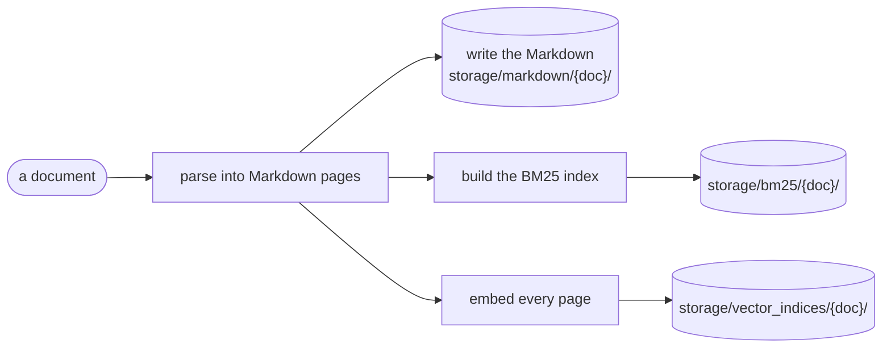

# Building and loading indexes

**Code:** [`services/indexing/`](../src/analyst_copilot/services/indexing/)

Plumbing only. Parse a document, build both indexes, save them, load them back.
The retrieval algorithms live in [`retrieval/`](../src/analyst_copilot/retrieval/).

## The flow



**The Markdown is written before embedding starts.** That is deliberate: if the
network dies halfway through embedding, you still have what the parser read. It
is also what the reader agents read in tier 3, so it is not a debugging
convenience — it is a load-bearing artifact.

## Parts

| Thing | Job |
|---|---|
| `FilingIndices` | Holds `doc_name`, `bm25_index`, `vector_index` |
| `FilingIndexer` | Parse + BM25 only |
| `HybridFilingIndexer` | Parse + BM25 + embeddings. This is the one used |

`HybridFilingIndexer` splits the work into `parse`, `build_indices` and
`save_indices` as well as doing all three at once, so the API can report progress
between the steps.

## Using it

```python
from analyst_copilot.services.indexing import HybridFilingIndexer
from analyst_copilot.retrieval import HybridSearcher

indexer = HybridFilingIndexer()
indices = indexer.index_filing("filings/3M_2018_10K.htm", save=True)
# already indexed? indexer.load_indices("3M_2018_10K")

result = HybridSearcher().search(
    indices.bm25_index,
    indices.vector_index,
    "FY2018 capital expenditure from the cash flow statement",
    top_k=5,
)
print(result.top_hit.page.citation_page, result.top_hit.score)
```

## Where things go

| What | Path |
|---|---|
| Markdown pages | `storage/markdown/{doc_name}/` |
| BM25 index | `storage/bm25/{doc_name}/` |
| Embeddings | `storage/vector_indices/{doc_name}/` |

For a **filing set**, everything moves under that set's own directory —
`storage/{set}/markdown/`, and so on. See [filing sets](14-collections.md).

`storage/` is not in git.

## Indexes rebuild themselves when parsing changes

Every index records the parser version it was built with. Change how documents
are parsed, bump `PARSER_VERSION`, and old indexes report as missing instead of
being quietly reused.

Without that, a parsing fix would be invisible: the code would be right and the
stored pages would still be wrong.

## There is no bulk indexing step

Every entry point indexes what it needs, when it needs it:

- Tier 1 builds a document's indexes the first time a question is asked about it
- The API indexes each upload and reports progress against the 10-minute budget
- The eval scripts index each file before asking its questions

## Scope

Indexes are per document. A **filing set** holds several documents and searches
them together, ranking their pages against each other — see [filing
sets](14-collections.md). The answer still cites exactly one document, because a
citation is only checkable against the document it names.
