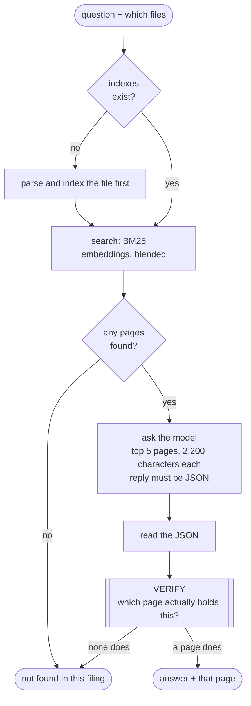

# Tier 1 — search and answer

**Code:** [`services/qa/`](../src/analyst_copilot/services/qa/) ·
[`llm/`](../src/analyst_copilot/llm/)

> **This is the first and cheapest tier.** It answers most questions it can
> answer at all, in about three seconds. What happens when it cannot is in [the
> agent harness](16-agent-harness.md).

It takes a question, finds pages, asks the model, and then checks the answer
against the page before showing it.

---

## The flow



## What the model is asked for

JSON, with four fields:

```json
{"not_found": false,
 "answer": "$1,577 million",
 "page": 59,
 "evidence_snippet": "| Purchases of property, plant and equipment (PP&E) | (1,577) |"}
```

The prompt tells it to use only the pages it was shown, never to invent a figure,
and to quote the line it read. It is also told which page to prefer when the same
figure appears in several places — the statement itself, not a summary of it.

## Verifying — evidence first, page second

This is the part worth understanding.

The obvious check is "is the answer on the page the model named?" That is the
right instinct and the wrong test, because **the page number is the least
reliable part of the whole chain.**

The same document is numbered differently as filed HTML and as the company's own
PDF. Across the practice corpus, **15 of 62 documents disagree by one or two
pages** between two readings of the same filing. Rejecting an answer over that
throws away answers whose evidence is provably right.

So the check runs the other way round. It scores **every** retrieved page for
whether it supports the answer, then cites the page that actually does. What the
model said is a hint.

| Result | What it means |
|---|---|
| `exact` | The model's page holds the evidence |
| `adjusted` | A page within 2 of it does. The citation moved there |
| `relocated` | A distant page holds the quote word for word. The citation moved there |
| `inferred` | The model named no page. The best-supported one was used |

**This does not loosen anything.** An answer is still only ever attached to a
page whose own text supports its figures. The change is that we go looking for
that page instead of requiring the model to guess its number. Moving a citation
never changes an answer.

### Figures are compared by their digits, not their text

A filing prints "Dollars in millions" and shows `8,738`. The question asks for
billions. The answer says `8.738`.

A text match rejects that correct answer. So we compare significant digits
instead: `8738`, `8.738` and `8.70` all trace to the page's `8,738`. That is
scale-free, and unlike a numeric tolerance it does not widen into a band that
some number on a dense financial page always falls inside.

At least one side must carry three significant digits, so a bare "65" cannot be
waved through by whatever two-digit figure happens to be nearby.

## When it refuses

| Reason | What happened |
|---|---|
| `no_retrieval_hits` | No page matched the question at all |
| `model_abstain` | The model said the pages were not enough |
| `empty_answer` | It claimed to have found something but gave no answer |
| `page_not_in_retrieval` | It cited a page it had not been shown |
| `number_not_on_page` | A figure in the answer traces to nothing on that page |
| `evidence_not_on_any_page` | No retrieved page supports the answer |
| `evidence_too_far_from_citation` | The only support is far away and not word-for-word. That is a coincidence, not evidence |

A refusal here is not the end. The harness takes over — see
[the harness](16-agent-harness.md).

## Its one limit

Tier 1 only ever sees 5 pages. On the practice questions those 5 pages contain
the right page **58% of the time**. The rest are not hard questions, they are
impossible ones: you cannot cite a page you were never shown.

That number is why tier 3 exists.

## Parts

| File | Job |
|---|---|
| `llm/openai.py` | Chat client, plus tool calling for the agents |
| `qa/prompts.py` | The system prompt and the excerpt block |
| `qa/parser.py` | Read JSON out of a reply, fences and all |
| `qa/verifier.py` | Find the page that proves it, or refuse |
| `qa/service.py` | `QuestionAnsweringService.answer(...)` |

## Demo

```bash
PYTHONPATH=src python scripts/examples/qa_example.py
PYTHONPATH=src pytest tests/test_qa.py
```
