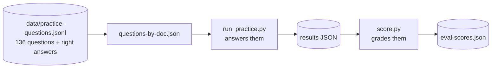

# Grading the system

Two steps. A **runner** answers the practice questions. A **scorer** grades those
answers against the answer key.



---

## The scoring rule

From the challenge spec:

| Outcome | Score |
|---|---:|
| Correct answer, correct page | **+1** |
| "not found in this filing" | 0 |
| Correct answer, wrong page | 0 |
| **Confidently wrong answer** | **−1** |

Two things follow, and they shape every decision in this codebase:

- A system that guesses finishes below zero.
- A system that always refuses finishes at exactly zero.

**A wrong answer costs twice what a refusal does.** So refusing well matters as
much as answering well.

---

## Step 1 — produce answers

```bash
# the full harness (planner + three tiers), all 136 questions
PYTHONPATH=src python scripts/eval/run_practice.py

# just the first 10
PYTHONPATH=src python scripts/eval/run_practice.py --limit 10

# the original pipeline alone, for comparison
PYTHONPATH=src python scripts/eval/run_practice.py --fast-only
```

**`--fast-only` is the one to remember.** It runs tier 1 by itself. That is the
number any change to the harness has to beat, and the runner prints which tier
answered each question so a score change can be traced to a cause.

Results are written after **every** question, so a run is safe to interrupt.

There is a second runner, `scripts/examples/run_all_questions.py`, grouped by
document. It resumes by skipping questions that already have answers — so
`--limit 5` there counts *unanswered* questions, not total ones. Check the
`Unanswered questions:` line it prints.

Both runners index a document first if it has no current index.

### What a result looks like

```json
{
  "text": "$1,577 million",
  "found": true,
  "page": 59,
  "mode": "fast",
  "abstention_reason": null,
  "retrieved_pages": [59, 57, 61, 43, 58],
  "computation": "",
  "inputs": []
}
```

`retrieved_pages` and `abstention_reason` together separate the two failures that
need completely different fixes:

| What you see | The problem is |
|---|---|
| The right page is **not** in `retrieved_pages` | Retrieval. Blending, query wording, chunking |
| The right page **is** there, but it refused | The prompt, the verifier, or truncation |

---

## Step 2 — grade them

```bash
PYTHONPATH=src python scripts/eval/score.py --results data/eval-results.json
PYTHONPATH=src python scripts/eval/score.py --results ... --judge
PYTHONPATH=src python scripts/eval/score.py --results ... --page-tolerance 1
```

### How correctness is decided

**Figures are checked with arithmetic.** If the right answer is basically a number
— `$1577.00`, `24.26`, `1.9%` — it is compared numerically, within 2%, and
scale-aware. So an answer of `8,738` in millions satisfies a key of `$8.70`
billion.

Whether an answer counts as "basically a number" is decided by counting *content*
words, not all words. Counting all words was too blunt: "The consumer segment
shrunk by 0.9% organically" is seven words, so it was graded against `0.9` alone,
and an answer naming the right segment without repeating the figure scored −1.

**Prose answers need `--judge`.** Some questions argue a conclusion, and no
arithmetic can check those. Without `--judge` they are reported as `unjudged` and
scored 0. **Always report judged and unjudged counts together** — an unjudged
question is missing data, not a zero.

⚠️ `--judge` uses the same chat model that produced the answers, so prose grades
carry a self-assessment bias. Spot-check a sample by hand.

**Pages must match exactly** by default. `--page-tolerance 1` shows what the
residual ±1 parser offset is costing you; the gap between the two runs is the
value left in better page alignment.

---

## Reading the output

```
RUBRIC SCORE: +1   over 10 evaluated question(s)
  +1  correct answer, correct location : 4
   0  correct answer, wrong location   : 2
   0  abstained (not found)            : 1
  -1  confidently wrong                : 3
```

It then lists every answer that cost −1, every right answer that lost its mark on
the page, and a count of why it refused.

**Read the −1 list first.** Those are the expensive mistakes, and each one is
worth two of the cheap ones.

---

## A warning worth repeating

**Better retrieval can lower the score.**

A change that lifted top-5 page accuracy from 4/10 to 7/10 *lowered* the rubric
score, because better retrieval also turns refusals into confident wrong answers.

The same thing happened to the whole harness: its first version read every page of
every document and scored **−1** against the original pipeline's **+2**.

So judge any change on the −1 column, not just the +1 column.

---

## Files

| File | What it is |
|---|---|
| `data/practice-questions.jsonl` | The answer key. **In git** — grading needs it |
| `data/questions-by-doc.json` | The same questions grouped by document |
| `data/eval-*.json` | Runs and scores. Not in git |

Rebuild the grouped file:

```bash
PYTHONPATH=src python scripts/examples/build_questions_by_doc.py
```
