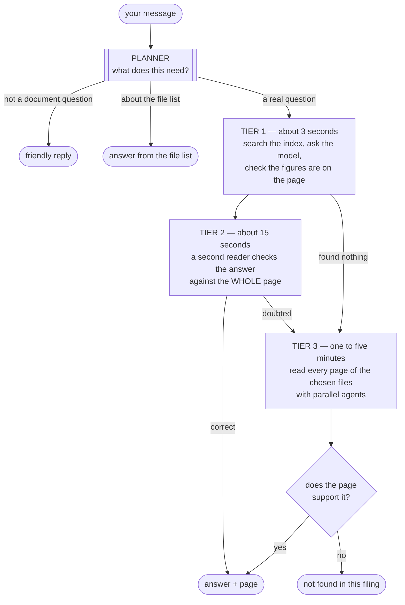
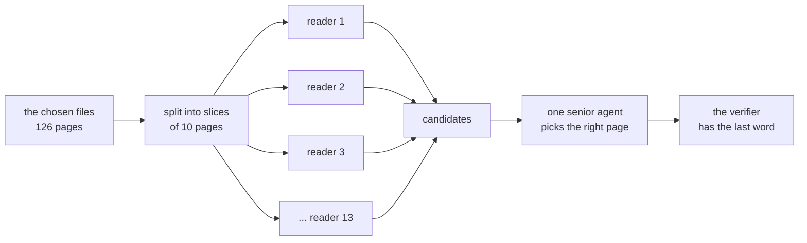

# The agent harness

**Code:** [`agent/`](../src/analyst_copilot/agent/) ·
**Entry point:** `AnalystAgent.answer` in [`agent/pipeline.py`](../src/analyst_copilot/agent/pipeline.py)

How a message becomes a proven answer, an honest refusal, or a reply to a
greeting.

---

## The short version

A message goes through a planner and then up to three tiers. Each tier is more
expensive than the last, and we stop at the first one that can prove its answer.



**The verifier at the end never moves.** Agents propose. It decides. Nothing
reaches you that the page's own text does not support.

---

## Why three tiers

Tier 1 is the original pipeline: search the index, pick the top 5 pages, ask the
model, check the figures.

It has one problem that no better prompt can fix. It only ever sees 5 pages. On
the practice questions, those 5 pages contain the right page **58% of the time**.
The other 42% are not hard questions. They are impossible ones — you cannot cite
a page you were never shown.

Tier 3 fixes that by reading everything. But reading more finds more *wrong*
answers too, so tier 2 sits in between to catch them.

Here is what each tier was built to fix, all measured:

| Problem | How often | Which tier |
|---|---|---|
| The right page was never retrieved | 42% of questions | Tier 3 |
| Right figure, wrong question or wrong page | 23 of 136 answers | Tier 2 |
| A computed figure could never be proved | 43 questions | The verifier |
| "Hi" got "not found in this filing" | every greeting | The planner |

---

## The planner

Decides what the message needs before anything runs. Four possible answers:
small talk, a question about the assistant, a question about the file list, or a
real question about the documents.

It also rewrites the question so it stands alone ("and the year before?" becomes
a full question), and picks which files are worth searching.

Full details, including the escape hatches that stop a wrong guess losing your
answer: **[the planner](20-planner-agent.md)**.

---

## Tier 1 — search and answer

Unchanged from before the harness existed. See
**[question answering](09-qa-pipeline.md)** and
**[document retrieval](07-hybrid-retrieval.md)**.

In short: search the BM25 and embedding indexes, blend the results, take the top
5 pages, ask the model for JSON, then check every figure in the answer traces to
the cited page.

---

## Tier 2 — the checker

A second reader that did not write the answer looks at it.

It gets the question, the answer, and the **whole cited page** — not the 2,200
character excerpt the first model saw. Then it rules one of three ways.

| Verdict | What happens |
|---|---|
| `correct` | Serve the answer |
| `incorrect` | Go to tier 3 |
| `insufficient` | Go to tier 3 |
| `unchecked` | Serve it. See below |

`unchecked` means the check could not run — no page text, or the model was
unreachable. We serve the answer anyway, because it already passed the figure
check, and escalating every question to a full document read because of a provider
hiccup would make everyone wait a minute.

### What it catches that figure-checking cannot

Tier 1 checks that the digits in the answer appear on the page. That catches an
invented number. It does not catch these:

- **Right figure, wrong conclusion.** "Is this business capital-intensive?"
  answered *yes* using figures that argue *no*. Every digit checks out.
- **Right figure, wrong period.** A quick ratio "for Q2" worked out from the
  March balance sheet. Every digit is on the page.
- **Half an answer.** A two-part question answered in one part. Reads complete.
- **The wrong shape.** "Which debt securities are registered?" answered with a
  count of four, one of which had matured.

All four are about *meaning*, so the checker leads with those and puts "is the
figure on the page" last.

**On a tier 3 answer there is no tier after this, so anything but `correct`
means we abstain.** That trade is deliberate: every deep answer this catches was
a wrong answer, and a wrong answer costs twice what a refusal does.

---

## Tier 3 — read everything



Eight readers run at a time. Each reader gets 10 pages and **may read only those
10**. Ask it for page 40 and the tool tells it which pages it does hold.

Two things follow from that:

1. Every page belongs to exactly one reader, so together they have read the whole
   file.
2. No two readers can report the same page. So when two readers both find a
   figure, they really did find it in two different places.

That second point matters more than it sounds. A filing prints its important
numbers several times. Asked for 3M's FY2018 capex, reader 6 found `(1,577)` in
the cash flow statement and reader 13 found the same figure in the five-year
summary. Both are correct. Only one is the right page to cite. Sorting that out
is the senior agent's whole job.

### Readers see whole pages

Readers read the stored Markdown, not the embedding index. The embedding index
only ever saw the first 2,500 characters of each page — and 13% of the right
evidence in this corpus starts after that point.

The worst case: page 1 of `3M_2023Q2_10Q` is 47,221 characters. Only 2,500 were
embedded. The answer to the registered-debt-securities question sits at character
45,234. Retrieval could never find it. A reader reads it normally.

### When no single reader can answer

Some questions need figures from two statements, and those statements are usually
in different readers' slices. Neither reader can answer. Together they hold
everything needed.

So a reader that cannot answer hands over what it *did* read:

```
found: false, partial: true, inputs: [{label, value, page}, ...]
```

The senior agent combines them. It can also read any page itself, so two
partials and a missing third figure is a page to go and read, not a reason to
give up.

**Measured.** "FY2017–FY2019 average capex as a % of revenue" used to read all
126 pages and return nothing. The figures were all there:

```
Capital expenditures   116   131   155     page 73
Total net revenues   6,489 7,500 7,017     page 70
```

Those two pages are in different slices, so nobody could answer, and the old code
threw away everything each reader had read. Now:

```
6 readers reported partial figures, 0 reported a full answer
→ 1.9%   gold answer 1.9%   cited page 73   all six inputs traced
```

Three guards, because a fragment is not an answer:

- A partial with no figures is not a contribution.
- A partial needs no page of its own; its figures carry theirs.
- If the senior agent is unavailable, we fall back to the strongest **complete**
  finding and abstain if there is none. Serving a fragment as a whole answer is
  exactly the mistake this pipeline exists to avoid.

---

## The tools agents use

| Tool | What it does |
|---|---|
| `list_pages` | The pages you may read, with each page's heading and size |
| `search_document` | Every matching line, with its page and line number |
| `read_page` | One page in full |
| `read_lines` | A numbered line range, so a table row arrives with its header |
| `calculate` | Exact arithmetic |

Three decisions worth knowing:

**Page numbers are the ones you see.** Every tool uses the 1-based number
`list_pages` prints. Inside the code, citations are 0-based. The conversion
happens in exactly one place, because a page number that changes meaning halfway
through is how a right answer gets cited to the wrong page.

**A tool never crashes at the model.** Bad arguments, a missing page, a broken
search pattern — all come back as normal output explaining the problem. A model
that reads an error fixes itself. An exception loses the question.

**Search ignores comma placement.** A filing's `1,577` and a search for `1577`
are the same number.

### Agents finish by calling a tool

An agent does not stop and write its answer as prose. It calls `report_finding`
(or `submit_answer`, or `report_validation`).

Why: prose has to be parsed, and the parsing fails in two ways that matter. The
JSON is sometimes malformed. Worse, a model with nothing to report will happily
write a paragraph about what it looked for, and a parser then has to decide
whether that counts as an answer.

Making the report a tool call moves the checking to the provider. A finding
arrives with the fields it must have, or it does not arrive. And **"I found
nothing" becomes a deliberate `found: false`** instead of an absence.

Prose instead of a report is never treated as evidence.

---

## Proving a computed answer

This unblocked a whole class of questions.

43 practice questions are arithmetic. An operating margin of 24.3% appears
**nowhere** in a filing. Only the operating income and the revenue do.

The old verifier required every number in the answer to be on the cited page. So
every computed answer failed by definition. All 43 were refusals, and the marks
were unreachable.

Now a computed answer is proved one level down. All four must hold:

1. Every input figure traces to the page it was read from.
2. The arithmetic is re-run here, in Python, from the recorded expression.
3. The numbers in that expression are the recorded inputs — so a real set of
   inputs cannot be used to launder an unrelated sum.
4. The result matches the figure the answer states, allowing for rounding and
   different units.

Worked example, measured:

```
Q     FY2019 fixed asset turnover for Activision Blizzard
gold  24.26, evidence pages 69 and 70

answer      24.26
computation 6489 / ((253 + 282) / 2)
inputs      Total net revenues FY2019    6,489   page 70
            Property and equipment, net    253   page 69
            Property and equipment, net    282   page 69
verified    DERIVED — all three inputs traced, arithmetic re-run
```

Each way of cheating is caught, and each has a test:

| Attempt | Result |
|---|---|
| An input that is not on its page | rejected: inputs do not appear on their pages |
| Real inputs, unrelated sum | rejected: the sum uses figures that are not inputs |
| Arithmetic that does not match the answer | rejected: the answer does not state the result |

Scale factors and rounding (`* 100`, `round(x, 2)`) are recognised as structure,
not as figures read off a page.

---

## Watching it work

`POST /chat/stream` sends progress as it happens. Two kinds of event.

**`stage`** — milestones. A handful per answer.

**`trace`** — the detail underneath. Several hundred per answer. Three sorts:

| Sort | Carries |
|---|---|
| `thought` | Text the model wrote before calling a tool |
| `tool` | The tool's name, nothing else |
| `agent` | One agent's status: running, found, partial, empty, failed |

Real example from a live run:

```
  0.0s  planning
  6.3s  retrieving
 22.0s  escalating — reading the whole filing
 22.0s  deep_search — reading 126 pages with 13 readers (0/13)
 37.5s  reader 7 found evidence (1/13)
 ...
110.5s  reader 11: nothing here (13/13)
110.5s  synthesizing — 1 of 13 readers found something
```

Everything on this channel is real. Nothing is invented to fill a quiet moment.

**Tool arguments and results are never sent.** A tool result is document text the
verifier has not seen. Putting it on screen would leak exactly the unproven
figures the product withholds. There is a test asserting the wire carries neither.

### The answer is not streamed

The verifier runs *after* the model replies. Streaming the model's words would
put an unproven figure on your screen for a second or two, which is the one thing
this product exists to prevent.

The text does animate in, but that is a **reveal of already-verified text**. It is
instant if you have reduced-motion turned on, instant for old messages, and never
replayed.

---

## Which page to cite

The same figure appears in the income statement, in the commentary, in a footnote
and in the five-year summary. Reading more of the document finds more copies. So
every agent that can cite is told which copy wins:

- The question names a statement → cite that statement.
- A bare figure with no source named → cite the primary financial statement, not
  a narrative page repeating it.
- "What drove / why did" → cite the management discussion, not the total.
- What the company does or sells → cite the business description, not a footnote.

---

## What it measured

First 10 practice questions, same code, same corpus, graded with `--judge`:

| | Tier 1 alone | Harness, first attempt | Harness, after fixing tier 2 |
|---|---:|---:|---:|
| **Score** | **+2** | **−1** | **+1** |
| Correct answer and page | 3 | 3 | **4** |
| Correct answer, wrong page | 2 | 2 | 2 |
| Refused | 4 | 1 | 1 |
| **Wrong answers** | **1** | **4** | **3** |

Read that honestly. **The first attempt was three points worse than the pipeline
it was meant to improve.** Reading more does not earn a mark. It earns the
*chance* to answer, and a wrong answer costs double.

None of the four wrong answers was invented. Every figure traced to its cited
page. Two of them landed on the **correct** page and were still wrong.

That is what forced tier 2 to cover deep answers too, which recovered two points.
It is still one point behind, for the same reason: the harness answers where tier
1 refused, and three of those answers are wrong. **Refusing better, not searching
harder, is what is left to fix.**

---

## What it costs

| | Tier 1 | Tier 1+2 | Tier 3 |
|---|---:|---:|---:|
| Time | ~3s | ~15s | 60–290s |
| Model calls | 1 | 2–4 | 15–40 |
| Relative cost | 1× | ~2× | ~50× |
| Can it miss the page? | 42% of the time | 42% | **never** |

Tier 3 runs only when the cheaper tiers could not prove an answer.

---

## Settings

In [`config/settings.py`](../src/analyst_copilot/config/settings.py), all
overridable by environment variable.

| Setting | Default | Effect |
|---|---|---|
| `agent_enabled` | `true` | The harness answers `/chat` |
| `agent_validate_answers` | `true` | Tier 2 |
| `agent_deep_search` | `true` | Tier 3. Off means refuse instead of reading everything |
| `agent_pages_per_shard` | `10` | Pages per reader |
| `agent_max_concurrency` | `8` | Readers at a time. Limited by the provider, not your CPU |
| `agent_max_shards` | `0` | Cap on readers per question. 0 = no cap. A cap means the file was not fully read, and it is logged |
| `agent_decompose` | `true` | Split questions that ask several things |
| `agent_history_turns` | `6` | Chat turns shown, so "and the year before?" works |

Planner settings are in [the planner doc](20-planner-agent.md#settings).

---

## Tests

```bash
PYTHONPATH=src pytest tests/test_agent_tools.py        # pages, tools, calculator
PYTHONPATH=src pytest tests/test_agent_runtime.py      # the agent loop, readers, partials
PYTHONPATH=src pytest tests/test_agent_verification.py # computed answers
PYTHONPATH=src pytest tests/test_agent_planner.py      # the planner and its guards
PYTHONPATH=src pytest tests/test_agent_pipeline.py     # tier boundaries and escapes
```

All offline. `ScriptedChat` replays fixed tool-calling turns, so the agent loop is
reproducible. `tests/offline_harness.py` builds the real pipeline with only the
model-calling parts stubbed, so the HTTP tests exercise the actual brain rather
than a copy of it.
