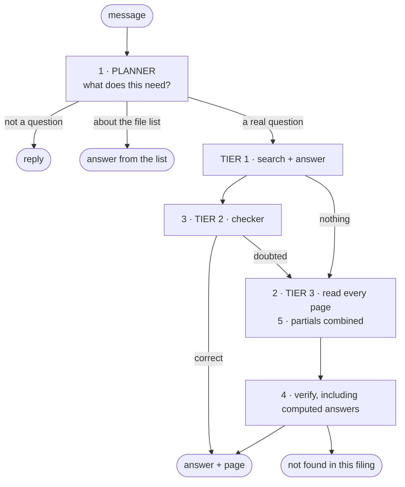

# What changed, and what it measured

A summary of everything added on top of the original retrieval pipeline. What each
change fixed, and what happened to the score.

Start here, then follow the links.



---

## Where it started

The system searched an index, took the top 5 pages, asked a model, and checked the
figures. Over all 136 practice questions that scored **+7**:

| | |
|---|---:|
| Correct answer and page (+1) | 29 |
| Refused (0) | 62 |
| Correct answer, wrong page (0) | 23 |
| **Wrong answer (−1)** | **22** |

Four things were wrong, and no better prompt could fix any of them.

| Problem | Why prompting could not help |
|---|---|
| 42% of questions unanswerable | The right page was never retrieved. You cannot cite a page you were not shown |
| 43 arithmetic questions unprovable | A computed figure appears nowhere in a filing. The check demanded it be on the page |
| Right figure, wrong question | 23 answers were correct and cited the wrong page. Checking digits cannot see meaning |
| "Hi" got "not found in this filing" | Every message went to retrieval |
| Reading every file, every time | Nothing asked which file could hold the answer |

---

## The changes

| # | What | Fixes | Details |
|---|---|---|---|
| 1 | [The planner](#1-the-planner) | Reading every file; searching for a file count | [19](20-planner-agent.md) |
| 2 | [Read every page](#2-read-every-page) | The 58% ceiling | [16](16-agent-harness.md) |
| 3 | [A second checker](#3-a-second-checker) | Right figure, wrong question | [16](16-agent-harness.md) |
| 4 | [Proving computed answers](#4-proving-computed-answers) | 43 unprovable questions | [16](16-agent-harness.md) |
| 5 | [Partial findings](#5-partial-findings) | Answers spanning two statements | [16](16-agent-harness.md) |
| 6 | [Splitting questions](#6-splitting-questions) | Two questions in one | [16](16-agent-harness.md) |
| 7 | [Showing the work](#7-showing-the-work) | A minute of silence | [11](11-api.md) |
| 8 | [Evidence you can check](#8-evidence-you-can-check) | A computed figure with nothing to inspect | — |
| 9 | [Choosing the colours](#9-choosing-the-colours) | A palette that looked decorative | [18](18-design-system.md) |

---

### 1. The planner

One decision before any work starts: is this small talk, a question about the
file list, or a real question — and if real, which files could hold the answer.

It replaced a router that decided the same thing from **125 hardcoded words**.
Those words leaked: "how many pages does this filing have" was read as a question
*from* the filing, because `filing` was on a list of finance words.

Measured on a three-file set:

| Message | Now | Files searched |
|---|---|---|
| Hi | small talk | none |
| How many docs you have provided? | about the file list | none |
| how many pages does this filing have | about the file list | none |
| What is the total revenue in FY2018? | a real question | **1 of 3** |
| how many segments does 3M report | a real question | all |

The last row is the one that proves it understands: "how many" did not fool it
into thinking it was about the file list.

**Every branch has a way out**, so a wrong guess costs seconds rather than the
answer. [Details](20-planner-agent.md#no-decision-is-final).

### 2. Read every page

When the cheap tiers cannot prove an answer, the file is split into slices of 10
pages, one reader agent per slice, eight at a time. Each reader may read only its
own pages, so together they cover the whole file and no two can claim the same
page.

Readers read the stored Markdown, so they see **whole pages** — past the 2,500
character embedding limit that hides 13% of the right evidence.

**Measured:** answered the registered-debt-securities question, whose evidence
sits at character 45,234 of a 47,221-character page. Retrieval could never reach
it.

But be careful about what that bought. On two questions the deep path found the
**right page** and still gave a **wrong answer** — an over-inclusive list, and
the wrong balance-sheet date. Reaching a page is not the same as reading it
correctly.

### 3. A second checker

A reader that did not write the answer sees the question, the answer, and the
**whole** cited page. It rules correct, incorrect or insufficient. Only correct
is served.

**Measured:** turned a wrong *yes* into a correct *no* on "is 3M
capital-intensive?" — a two-point swing on one question, from checking whether the
conclusion follows from the figures.

### 4. Proving computed answers

An operating margin appears nowhere in a filing. Only the two figures behind it
do. So a computed answer is proved one level down: every input traced to its page,
the arithmetic re-run in Python, and the result matched against what the answer
claims.

**Measured:** Activision's FY2019 fixed asset turnover — **24.26** against a key
of 24.26, cited to one of the two right pages. That was a guaranteed refusal
before.

### 5. Partial findings

Some questions need figures from two statements, and those are usually in
different readers' slices. Neither reader can answer; together they have
everything.

So a reader hands over what it *did* read, and the senior agent combines them.

**Measured:** "FY2017–FY2019 average capex as a % of revenue" used to read all
126 pages and return nothing. Now it returns **1.9%** against a key of 1.9%, from
six partial findings and no complete ones.

### 6. Splitting questions

A message asking several things becomes several questions, each searched and
**cited separately**. The parts are joined in code, not by a model — a model asked
to merge four answers rewrites their figures, and a figure that changes after
verification is unverified again.

### 7. Showing the work

`POST /chat/stream` sends progress as it happens: which agent is running, what it
said it was about to look for, which tool it called. The UI shows this in two
panels, **collapsed by default**.

What streams is **progress, not the answer**. The verifier runs after the model
replies, so streaming the model's words would put an unproven figure on screen.
The text does animate in, but that is a reveal of text that is already checked.

Tool arguments and results never leave the process — a tool result is document
text the verifier has not seen.

### 8. Evidence you can check

A computed answer needs a different kind of proof, so the evidence panel gained a
**"Computed, not quoted"** section: every input with the page it came from, and
the expression the verifier re-ran.

Also: a badge when the whole file was read, and a refusal that says "all 126 pages
were read by 13 agents" rather than just "no match".

### 9. Choosing the colours

The accent colour is picked in Settings and stored per browser. Green, amber and
red stay reserved for what the system proved, refused or failed to do. See [the
design system](18-design-system.md).

---

## What it measured

First 10 practice questions, same code, same corpus, graded with `--judge`:

| | Original pipeline | Harness, first attempt | Harness, after fixing the checker |
|---|---:|---:|---:|
| **Score** | **+2** | **−1** | **+1** |
| Correct answer and page | 3 | 3 | **4** |
| Correct answer, wrong page | 2 | 2 | 2 |
| Refused | 4 | 1 | 1 |
| **Wrong answers** | **1** | **4** | **3** |

Read that honestly. **The first attempt was three points worse than the pipeline
it was meant to improve.** Reading more of a document does not earn a mark. It
earns the *chance* to answer, and a wrong answer costs double.

None of the four wrong answers was invented. Every figure traced to its cited
page. Two of them landed on the **correct** page and were still wrong.

Extending the checker to cover deep answers recovered two points. It is still one
point behind, for the same reason: the harness answers where the old pipeline
refused, and three of those answers are wrong.

## What is still wrong

| | |
|---|---|
| **Refusing better is what is left** | Two of the three remaining wrong answers should have been refusals |
| **One answer disclaims its own evidence** | It is served as found while its text reads *"the provided excerpts do not report a quick ratio for Q2 FY2023"*. Catching that is a simple check, not a judgement |
| **The full 136 have not been re-run** | Every number above is a 10-question sample. The +7 is the old pipeline only |
| **Split questions are under-scored** | The key gives one right page per question; a split answer returns one citation per part, and the grader reads only the first |

All tracked in [PLAN.md](../PLAN.md).

## What it costs

Measured on the running app, same question, before and after taking the planner's
predecessor off the critical path:

| Step | Before | After |
|---|---:|---:|
| deciding what it needs | 25.6s | 0.1s |
| retrieval + answer | 63.2s | 8.0s |
| checking | 8.3s | 5.5s |
| **total** | **97.2s** | **13.6s** |

Be sceptical of the middle row — that is provider variance, not a change. The
same run measured 14.8s earlier in the day and 63s under load. The first row is
the real improvement.

| | Tier 1 | Tier 1+2 | Tier 3 |
|---|---:|---:|---:|
| Time | ~3s | ~15s | 60–290s |
| Model calls | 1 | 2–4 | 15–40 |
| Relative cost | 1× | ~2× | ~50× |
| Can it miss the page? | 42% | 42% | **never** |

## Tests

281, all offline. Nothing needs a provider, a network or a document.

```bash
PYTHONPATH=src pytest
```
