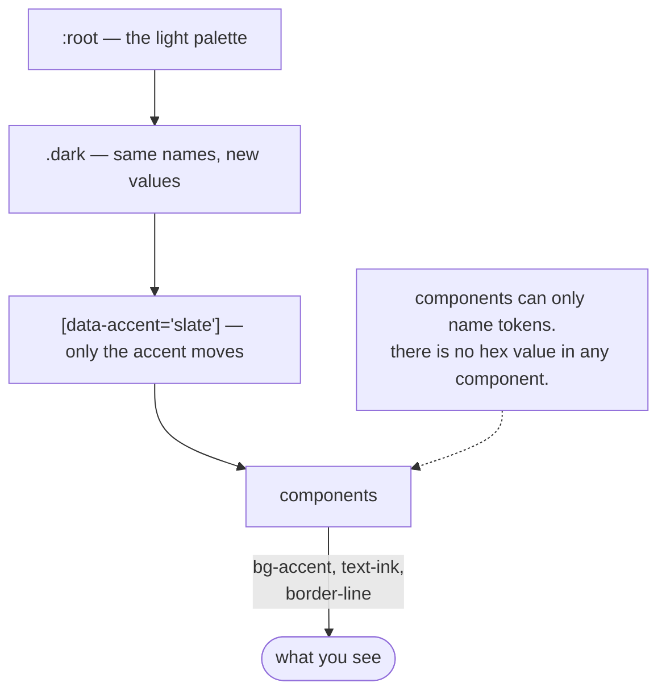

# The design system

**Tokens:** [`ui/src/styles/globals.css`](../ui/src/styles/globals.css) ·
**Accents:** [`ui/src/lib/accents.ts`](../ui/src/lib/accents.ts)

One rule, and everything follows from it.

## Colour means something

Green, amber and red are **reserved for what the system did**. If something is
green, the system proved it. If it is amber, the system refused. Nothing is those
colours for decoration.



That is enforced by structure, not by good intentions:

- Every colour is a CSS variable, and Tailwind exposes only the names. **There is
  no hex value in any component** — checked with `grep`.
- A `Badge` takes a `tone`, not a colour. So a component cannot paint something
  green by accident.

| Token | Means |
|---|---|
| `canvas`, `surface`, `surface-raised`, `surface-sunken` | Depth, back to front |
| `line`, `line-strong` | Borders |
| `ink`, `ink-muted`, `ink-subtle` | Text, three levels |
| `accent`, `accent-soft`, `accent-ink` | Things you interact with |
| `verified` | **The system proved this** |
| `declined` | **The system refused**, or something was cut short |
| `failed` | An error |
| `building` | Indexing in progress |

Light is the base. Dark redefines the same names. One set of names, two themes.

## Accent themes

The accent is chosen in Settings, stored per browser, and written to
`data-accent` on `<html>`. Five options:

| Accent | Character |
|---|---|
| **Slate** *(default)* | Muted blue-grey. Restrained and unshowy. |
| **Navy** | Steel blue. More saturated, more institutional. |
| **Teal** | Deep cyan. Technical rather than corporate. |
| **Graphite** | Near-black. The only colour left on screen then means something. |
| **Indigo** | The original violet-blue, kept for anyone who preferred it. |

### Why five and not a whole spectrum

Because of the rule. An accent near green, amber or red would look like a status.
A button the same green as "verified" breaks the only promise the palette makes.

That leaves blues, teals and neutrals — which is also what professional financial
tools tend to use.

Two of the themes also move `building`: the indexing badge is blue, and a blue
accent beside it would be taken for the accent.

| Accent | `building` becomes |
|---|---|
| Slate, Graphite, Indigo | unchanged (blue, hue 205) |
| Navy | cyan (hue 192) |
| Teal | indigo-blue (hue 224) |

### Why the swatches cannot lie

The colours live **only** in CSS, keyed on `[data-accent='…']` rather than on
`:root`. `lib/accents.ts` carries the list, the names and the reasoning — no
values.

This is not just tidiness. Each swatch in the picker carries its own
`data-accent`, so it paints in the **real colours** of the theme it selects — even
while a different accent is active.

The alternative is copying hex values into TypeScript, which is how a swatch ends
up showing a colour the app no longer uses.

```css
/* applies to <html data-accent="navy"> and to a swatch inside the picker */
[data-accent='navy'] { --accent: 218 82% 42%; … }
.dark[data-accent='navy'], .dark [data-accent='navy'] { --accent: 211 92% 66%; … }
```

### The base tokens are the default

`:root` and `.dark` also define an accent — slate's values, duplicated. That is
the pre-JS fallback: what paints if the document is styled before the stored
accent reaches `data-accent`. **It has to agree with `DEFAULT_ACCENT` in
`lib/accents.ts`** or the app flashes one palette on the way into another. There
is a comment on both saying so.

### Who applies it

The store owns the DOM side-effect, and applies on every change, at boot before
first paint, and on rehydration. There is deliberately **no second mechanism** —
an effect in `AppShell` used to apply the theme as well, and two things writing
the same attribute is how one of them silently stops mattering.

A stored accent this build no longer offers falls back to the default rather than
leaving the app unthemed. A stored accent that *is* still offered is never
overwritten by a change of default: it may be a real choice.

---

## Typography

| | |
|---|---|
| Sans | Inter, with `cv02 cv03 cv04 cv11` |
| Mono | JetBrains Mono |

**Every figure, page number and snippet renders in mono, with tabular
numerals.** Misreading `1,577` as `1.577` is the exact error this product exists
to prevent, and proportional digits in a column of figures invite it. The
`.tabular` class sets `font-variant-numeric: tabular-nums`.

## Motion

Animations are short and purposeful — `fade-up` for arriving content, `breathe`
for the thinking indicator. All of it collapses to ~0ms under
`prefers-reduced-motion: reduce`.

## What is deliberately absent

- **No component library.** `components/ui/` is hand-written, so every surface
  stays restylable. MUI and AntD both fight a custom design language.
- **No streamed answers.** Verification runs after the model replies, so an
  answer rendering token-by-token would show an unproven figure. Progress
  streams instead; the answer arrives atomically. See
  [Agent harness](16-agent-harness.md#progress-and-why-the-answer-is-not-streamed).
- **No retrieval settings in the UI.** Ship the measured configuration; do not
  expose the weights.
