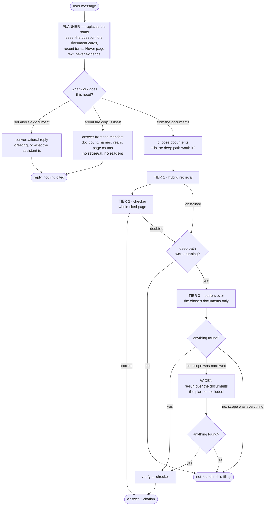

# Planner agent — design proposal

**Status:** proposal, for discussion. Nothing here is implemented.
**Problem:** the harness executes a fixed strategy. It does not decide *how* to
attack a question before attacking it.

---

## 1. The two gaps, measured

Both are real. One of them I introduced earlier today.

### 1a. Deep search reads every document, always

`DocumentCorpus.shards()` iterates `available_documents()` and shards every page
of every document. Nothing between the question and the fan-out looks at *which*
document could possibly hold the answer.

```python
# agent/corpus.py — the whole of the scoping logic today
for doc_name in self.available_documents():
    pages = self.pages_of(doc_name)
    for start in range(0, len(pages), pages_per_shard):
        ...
```

So for a filing set of FY2018 / FY2019 / FY2020 and the question *"What was
total revenue in FY2018?"*:

| | Readers | Wall clock (concurrency 8) | Cost |
|---|---:|---:|---:|
| Today — all three documents | **39** | ~5 waves | 3× |
| Scoped to FY2018 | **13** | ~2 waves | 1× |

Two thirds of that work cannot possibly contain the answer. Measured on the
filing sets actually loaded here:

```text
ACTIVISION         1 doc   126 pages   13 readers per escalated question
Boeing 2022        1 doc   189 pages   19 readers per escalated question
VERIZON_2022_10K   1 doc   115 pages   12 readers per escalated question
```

Single-document sets hide the problem entirely. It appears the moment a filing
set holds a year range — which is the case the product was built for: *"a
question is rarely about one file"*.

### 1b. Questions about the corpus are answered by searching the corpus

*"How many docs have you provided?"* needs no retrieval, no readers and no
verifier. It needs the collection manifest.

Measured, on the live router:

| Message | Routes to | Correct? |
|---|---|---|
| `how many docs?` | `capability` | ✅ (via a model call) |
| `list the documents` | `capability` | ✅ (via a model call) |
| `which years are covered by these filings` | `capability` | ✅ (via a model call) |
| `how many 10-K documents are loaded here` | **`document_question`** | ❌ |
| `how many pages does this filing have` | **`document_question`** | ❌ |

The two failures are **caused by the routing short-circuit I added earlier
today** to take a 25-second model call off the critical path:

- `how many 10-K documents are loaded here` — eight words, and `10-K` contains a
  digit. Both are document-question signals.
- `how many pages does this filing have` — `filing` is in the finance-term list.

That optimisation was worth making and it was the wrong shape. A message can
carry every signal of a document question and still be a question *about* the
corpus rather than *from* it, and no word list can tell the difference.

### 1c. The routing decision is 125 hardcoded tokens

The real problem is not the two misroutes. It is what produces them:

| In `agent/router.py` | Count |
|---|---:|
| `_EXACT_SMALLTALK` phrases | 49 |
| `_EXACT_CAPABILITY` phrases | 15 |
| `_FINANCE_TERMS` | 61 |
| `_LONG_MESSAGE_WORDS` | a magic `8` |
| **Total hardcoded classification tokens** | **125** |

Every one of those is a guess about how an analyst will phrase something, and
each is a place the router can be wrong in a way nobody notices until a user
types the sentence that falls between two lists. `filing` being a finance term is
correct nine times in ten and wrong for *"how many pages does this filing have"*.
Adding `how many pages` to a counter-list fixes that sentence and not the next
one.

A word list cannot classify intent. It can only approximate it, and the
approximation is now provably leaking.

**All three of these are the same gap.** The system does not decide what kind of
work a question needs; it pattern-matches its way to a strategy and executes it.

---

## 2. What a planner is, and is not

**Is:** one step that looks at the question and the filing set and decides *what
to run* — reply conversationally, answer from metadata, search one document,
search all of them, skip the deep path entirely.

**It replaces the router.** Not "and also does routing" — replaces it. The 125
hardcoded tokens go, and one model call makes the decision that four word lists
and a magic number currently approximate. That is the point of the exercise as
much as the token saving is.

**Is not:** a re-ranker, a retriever, or anything that touches evidence. It never
sees page text and never proposes an answer. It narrows the search space; the
existing tiers still do the work and the deterministic verifier still has the
last word.

### The central risk, stated first

**A planner that scopes wrongly is worse than no planner.**

Today's fan-out is expensive and has no recall ceiling: the answer is in the
document, so some reader will see it. A planner that picks FY2019 when the answer
is in FY2018 makes the answer **unreachable** — and the rubric charges for that:
a missed answer is 0, and an answer read confidently from the wrong year is
**−1**.

The measured history of this project is a warning here. The first cut of the
harness scored **−1 against the fast path's +2** because it answered more and
abstained less. Anything that narrows the search must be assumed to narrow it
wrongly sometimes, and must be designed around that.

So the planner gets one non-negotiable property:

> **Scoping is a hypothesis, not a commitment.** If the scoped search finds
> nothing, the search widens automatically before the system abstains.

That turns a wrong scope into *lost time* instead of *a lost answer*.

---

## 3. Proposed flow



```

The planner sits where the router sits today, and answers a wider question. The
four intent classes replace three; `documents` and `deep_path` are new.
Everything below the planner is the pipeline that exists now.

---

## 4. The pieces

### 4a. Document cards — the planner's input

The planner cannot choose documents it knows nothing about. Today a collection
manifest holds only this per document:

```json
{"doc_name": "3M_2018_10K", "source_file": "...", "source_format": "html",
 "segment_count": 131, "added_at": 1787...}
```

No company, no fiscal year, no period, no document type. So a planner would have
to guess from the filename — which is user-controlled and often wrong.

Proposal: extract a small **document card** once, at index time, and store it on
the manifest.

```json
{"doc_name": "3M_2018_10K",
 "company": "3M Company",
 "fiscal_year": 2018,
 "period": "FY2018",
 "doc_type": "10-K",
 "period_covered": ["2018", "2017", "2016"],
 "segment_count": 131}
```

`period_covered` matters more than it looks: a 2019 10-K carries **three years**
of income statement and cash flow columns. A planner that scopes *"FY2017
revenue"* to a document named `..._2019_10K` is right, and one that reasons only
from `fiscal_year: 2019` is wrong. This field is why the Activision three-year
average worked at all.

Cost: one cheap call per document at index time, cached forever. Indexing already
takes minutes; this is noise. Regex on the filename can seed it and the first
page can confirm it.

### 4b. What the planner decides

| Decision | Values | Consequence |
|---|---|---|
| `kind` | `smalltalk` \| `capability` \| `corpus_meta` \| `document` | Which path runs at all |
| `documents` | subset of the filing set | What tier 1 and tier 3 may look at |
| `confidence` | low \| high | Low confidence ⇒ do not narrow at all |
| `deep_path` | worth it \| not | Whether an abstention should escalate |

### 4c. Where it runs

**First. In place of the router.** One call on the critical path, and it must be
cheap: the document cards are small and the question is short, so it is a few
hundred tokens either way.

What it costs, honestly:

| | Today | With the planner |
|---|---|---|
| Greeting | 0 calls (literal match) | **1 call** |
| Obvious document question | 0 calls (heuristic) | **1 call** |
| Ambiguous message | 1 call (router) | 1 call |
| Document question needing scoping | 1 call (router) + no scoping | 1 call |

So it is *cheaper* than router-plus-planner would be, and **more expensive than
today for the two cases the heuristics currently catch for free**. That is the
price of the 125 tokens going away, and it is a real price: the measurement that
motivated the heuristics was a 25-second routing call against a slow provider.

The one skip I would still argue for is structural rather than semantic:

- **A single-document filing set has nothing to scope.** The planner still has to
  classify, so this saves nothing on its own — noted only because it means
  scoping logic never runs for the sets loaded here today.

Any skip based on *what the words are* is the thing we are removing. If the
latency proves unacceptable, the answer is a faster model for the planner or a
cache keyed on the exact message — not a word list.

---

## 5. Decisions I need from you

**D1. Does the planner scope tier 1 as well, or only tier 3?**
Tier 1 is cheap and cross-document ranking is deliberate — pooling candidates
across documents before normalising is what makes a folder answerable at all
(see [docs/14](14-collections.md)). Narrowing it saves little and risks the
retrieval quality that everything else rests on.
*My recommendation: tier 3 only, at first.* Measure, then decide about tier 1.

**D2. How aggressive should scoping be?**
- **Conservative** — narrow only when the question names a period that exactly
  one card covers. Few questions qualify; near-zero risk.
- **Confident** — narrow whenever the planner is sure, widen on empty.
- **Aggressive** — always pick the single best document first, widen on empty.
*My recommendation: confident, with the widen fallback mandatory.*

**D3. `corpus_meta` — templated answers or an LLM with the manifest?**
A templated answer ("3 documents: A, B, C") cannot be wrong but cannot handle
"which years do these cover?". Handing the manifest to the conversational
responder handles any phrasing but can miscount.
*My recommendation: give the responder the manifest as structured facts and
forbid it from computing — counts and lists come pre-computed in the prompt.*

**D4. What happens to the router's 125 hardcoded tokens?**
~~Patch the lists now, fold into the planner later.~~ Rejected — patching a word
list to fix the sentence that broke it fixes only that sentence, and the next
phrasing falls through the same gap.

So: **the planner replaces the router outright** and the lists are deleted, not
extended. The open question is only whether anything survives in front of it:
- **Nothing.** Every message costs one planner call, greetings included.
- **An exact-message cache.** Same call the first time; free for a repeat of a
  message seen verbatim. Not a word list — no semantics, no guessing.
*My recommendation: nothing in front of it to begin with. Measure the latency on
a greeting, and add the cache only if it actually reads badly.*

**D5. Does a wrong scope ever get to abstain without widening?**
Widening doubles the worst-case latency of an unanswerable question — 39 readers
after 13. The alternative is abstaining on a question whose answer is present.
*My recommendation: always widen. An abstention we could have answered is the
expensive kind of wrong.*

---

## 6. How we would know it worked

The planner is a **cost** optimisation with a **correctness** risk, so it needs
both measured, and the correctness one first.

| Metric | Target | Why |
|---|---|---|
| Rubric score on the practice key | **unchanged or better** | The gate. A planner that saves tokens and loses a mark is a regression. |
| Readers per escalated question | down | The point. |
| Widen rate | low | High means the scoping is guessing. |
| Answers rescued by widening | should be **> 0** | If never, the fallback is untested rather than unnecessary. |
| `corpus_meta` questions reaching retrieval | **0** | Gap 1b closed. |

A multi-document filing set is needed to measure any of this — every set loaded
here today has one document, which is precisely why the gap went unnoticed.
Building a 3M 2018/2022/2023Q2 set from the corpus is the first task.

---

## 7. What could go wrong

| Risk | Mitigation |
|---|---|
| Wrong document chosen, answer lost | Mandatory widen on empty |
| Wrong document chosen, answer found in the wrong year | **The real danger.** Same figure, wrong period — the verifier cannot see it, since every digit traces. The checker's period rule is the only guard, and it is a prompt. |
| Planner adds a call to every message, greetings included | Accepted cost of deleting the word lists. If it reads badly, a faster planner model or an exact-message cache — not a heuristic |
| Provider latency now hits every message | Today a greeting is free. Measured once at 25s for a routing call under load, this is the risk with teeth |
| Document cards wrong | Seed from filename, confirm from page one, and never let a card *exclude* a document on its own — only rank it lower |
| Another tier, another thing to go wrong | It is the fourth model in a chain. Worth asking whether the token saving justifies that before building it. |

The second row is the one to think hardest about. It is the failure mode the
harness already has — three of the current −1s are wrong-period or wrong-scope
answers — and a planner that narrows to the wrong document makes it *more* likely,
not less.

---

## 8. My honest read

Gaps 1b and 1c are worth fixing regardless. Replacing 125 hardcoded tokens with
one decision removes a whole class of silent misclassification, and it carries no
document-scoping risk because classification does not scope anything. I would do
that whether or not we ever narrow a search.

Gap 1a (document scoping) is a real 3× cost on multi-document sets, and the
saving is genuine. But it buys **cost, not accuracy**, and every previous change
in this project that traded correctness for reach cost more than it gained. I
would build it behind a setting, measure the rubric first and the tokens second,
and be prepared to leave it off.

The order I would propose:

1. Build a multi-document filing set — nothing below can be measured without one
2. Document cards at index time — useful on their own, and the planner's input
3. The planner, replacing the router: classify into four kinds, delete the 125
   hardcoded tokens. **This alone closes 1b and 1c**, and carries no
   document-scoping risk because it does not scope yet.
4. Measure: rubric unchanged, and what a greeting now costs
5. `corpus_meta` answered from the manifest
6. Document scoping for tier 3, behind a setting, with mandatory widen
7. Measure the rubric first and the tokens second

Steps 3 and 6 are separable, and worth separating: step 3 is a correctness fix
that removes guesswork, step 6 is a cost optimisation that adds a way to be
wrong. Shipping them together would make a regression impossible to attribute.
