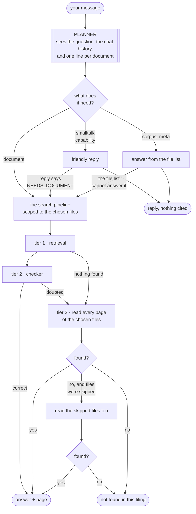

# The planner

**Code:** [`agent/planner.py`](../src/analyst_copilot/agent/planner.py) ·
[`agent/cards.py`](../src/analyst_copilot/agent/cards.py) ·
[`agent/facts.py`](../src/analyst_copilot/agent/facts.py)

The planner makes one decision before any work starts: **what does this message
actually need?**

---

## Why it exists

Two problems, both measured.

**Problem 1: it read every document, every time.**

Say a filing set holds three files: FY2018, FY2022 and FY2023 Q2. You ask "what
was total revenue in FY2018?".

The old system read all three. That is 39 reader agents. Only 13 of them could
possibly find the answer. The other two thirds were wasted time and wasted
tokens.

**Problem 2: it searched the filing to count the filings.**

You ask "how many documents do you have?". The answer is in a list of files. The
old system searched 189 pages of a 10-K for it.

Some phrasings worked, some did not:

| You typed | Old system | Right? |
|---|---|---|
| how many docs? | answered from the file list | ✅ |
| how many pages does this filing have | searched the filing | ❌ |
| how many 10-K documents are loaded | searched the filing | ❌ |

The two failures happened because the old router matched words. The word
`filing` was on a list of finance words. So "how many pages does this **filing**
have" looked like a question *from* the filing.

There were **125 hardcoded words and phrases** doing that job. All of them are
now deleted. A word list cannot understand a question. It can only guess, and the
guesses were wrong in ways nobody noticed until someone typed the wrong sentence.

---

## What it decides

One model call. It sees the message, the recent chat turns, and one line per
document. It returns four things.

| It returns | Meaning |
|---|---|
| **kind** | Which path to run: `smalltalk`, `capability`, `corpus_meta` or `document` |
| **question** | The message rewritten so it stands alone |
| **documents** | Which files could hold the answer. Empty means "all of them" |
| **confidence** | How sure it is. Below 0.8 we search everything |

### The four kinds

| Kind | Example | What runs |
|---|---|---|
| `smalltalk` | "Hi", "thanks" | A friendly reply. Nothing else |
| `capability` | "what can you do?" | A reply about the assistant |
| `corpus_meta` | "how many documents?" | Answered from the file list. No search |
| `document` | "what was FY2018 revenue?" | The full search pipeline |

The line between `corpus_meta` and `document` is **what the question is about**.
"How many documents do you have" is about the *set*. "How many segments does 3M
report" is about what is *inside* a filing, so it needs reading. "How many" alone
proves nothing.

### Rewriting the question

If you ask "and the year before?", that cannot be searched for. Nobody
downstream knows what "the year before" means.

So the planner rewrites it once, at the top:

```
you typed:  and the year before?
researched: What was 3M's capital expenditure in FY2017?
```

Every step below then gets a question that makes sense on its own. This also
fixed a real bug: the checker never sees the chat history, so it used to be asked
"is this answer responsive to 'and the year before?'" and could not possibly
know.

---

## The flow



Notice the two arrows pointing back into `SEARCH`. Those are the escape hatches,
and they are the most important part.

---

## No decision is final

The worry with a planner is obvious: it is one guess in front of everything. Get
it wrong and the whole answer is wrong.

So every branch has a way out. **A wrong guess costs a few seconds, never the
answer.**

### Not all mistakes are equal

| Planner says | Truth | What happens |
|---|---|---|
| `document` | it was "hi" | We search, find nothing, say so. Slightly silly. Harmless |
| `smalltalk` | it was a real question | We answer from nothing. **Bad** |
| `corpus_meta` | it was a real question | We answer from the file list. **Bad** |
| search only FY2018 | answer is in FY2022 | The answer is unreachable. **Bad** |

The pattern: **guessing "search the document" is safe. Guessing the other way is
not.** So the planner is told to pick `document` whenever it is unsure.

### The three escapes

**1. The chat reply can refuse.**

If the planner sends a real question to the chat path, the reply is allowed to
answer with exactly `NEEDS_DOCUMENT` instead of guessing. The message then goes
back and gets searched properly.

Tested live:

```
"What was FY2018 revenue?"  →  planner said smalltalk
                            →  reply said NEEDS_DOCUMENT
                            →  searched properly, answer found
```

**2. The file list can refuse.**

`corpus_meta` answers come from facts counted in Python, not by the model. If the
question asks something the file list does not contain, there is nothing to answer
with, so it falls through to a real search.

**3. A scoped search widens.**

If the planner picks FY2018 and FY2018 holds nothing, we then read the files it
skipped. Both passes are counted in the reported cost, so you see what the
question really took.

### The one case with no escape

There is one mistake no fallback catches.

Suppose the planner searches only FY2022, and FY2022 *also* has a revenue
figure. We find it. Every digit is genuinely on the page, so the verifier is
happy. But it is the wrong year.

This already happens. One of the three current wrong answers is a quick ratio
taken from the March balance sheet when the question asked about June.

**Narrowing the search makes this more likely, not less.** That is why scoping is
careful by default, and why the checker's period rule matters so much.

---

## Document cards

The planner cannot choose between files it knows nothing about. So each file gets
one line, built from its filename. No model call, no page reads.

```
3M_2018_10K (131 pages) — 3M — FY2018 — 10-K — reports figures for 2018, 2017, 2016
3M_2023Q2_10Q (60 pages) — 3M — FY2023 Q2 — 10-Q — reports figures for 2023, 2022
document1 — period unknown, cannot be ruled out
```

**The "reports figures for" part matters most.** A 10-K prints three years of
income statement and cash flow. So a 2019 10-K answers a 2017 question. A planner
that only knew "this is the 2019 filing" would send a 2017 question to the wrong
file, or to no file at all.

| Document type | Years of figures |
|---|---:|
| 10-K, 20-F, annual report | 3 |
| 10-Q | 2 |
| 8-K | 1 |

**A card is a hint, not a fact.** Filenames come from users. A file called
`document1.pdf` gets a card with nothing in it, and the rule is that a file we
cannot describe is **never excluded** — only ranked lower. Guessing wrong about a
filename must cost nothing.

---

## How scoping is kept safe

Three guards, in code, not in a prompt.

**1. Only narrow when the question names a year.** Then the choice can be checked
against the cards instead of trusted. This is the careful policy and it is the
default.

**2. Put back any file that reports a named year.** Whatever the planner
proposed, if a file's card says it reports 2018 and the question asks about 2018,
it goes back in. A filename hint must not be able to exclude a file that
demonstrably covers the period.

**3. Ignore a scope that matches nothing.** If the planner names files this
filing set does not hold, we search everything rather than searching nothing.

Plus: a scope naming *every* file is treated as no scope at all, and a
single-file set is never scoped, because there is nothing to choose.

---

## Measured

Live, on a three-document set:

| Message | Kind | Files searched |
|---|---|---|
| Hi | `smalltalk` | none |
| How many docs you have provided? | `corpus_meta` | none |
| how many pages does this filing have | `corpus_meta` | none |
| What is the total revenue in FY2018? | `document` | **3M_2018_10K only** |
| How did margin move from 2018 to 2022? | `document` | all |
| how many segments does 3M report | `document` | all |

Row 3 was a search of 189 pages before. Row 4 is one file instead of three.
Row 6 is the one that proves it understands the difference: "how many" did not
fool it.

End to end through the running app:

```
0.1s  planning
0.1s  planner running
10.3s planner: corpus_meta — the question asks about the document set itself
12.3s answer: "I have one document loaded: 3M's 2018 Form 10-K."
```

No retrieval. No readers. It used to read 134 pages for this.

---

## Settings

All in [`config/settings.py`](../src/analyst_copilot/config/settings.py).

| Setting | Default | What it does |
|---|---|---|
| `planner_enabled` | `true` | Off means every message is treated as a document question |
| `planner_scope_documents` | `true` | Off means every file is read on every deep search |
| `planner_scope_requires_year` | `true` | The careful policy. Off lets the planner narrow on its own judgement |
| `planner_min_confidence` | `0.8` | Below this, search everything |
| `planner_widen_on_empty` | `true` | **Turning this off removes the safety net** |

---

## What it costs

One model call on every message, including "hi".

The old router got greetings and obvious questions free, using those 125
hardcoded words. That was faster and it was wrong. A routing call was once
measured at 25 seconds against a slow provider, so this is a real cost, not a
theoretical one.

If it becomes a problem, the fix is a faster model for the planner, or a cache
keyed on the exact message. **Not another word list.**

---

## Tests

```bash
PYTHONPATH=src pytest tests/test_agent_planner.py    # cards, facts, the scope guards
PYTHONPATH=src pytest tests/test_agent_pipeline.py   # the escapes, and widening
```

All offline. The scope guards are the part worth reading: they are what stops the
planner losing an answer, and each one has a test named after the mistake it
prevents.
