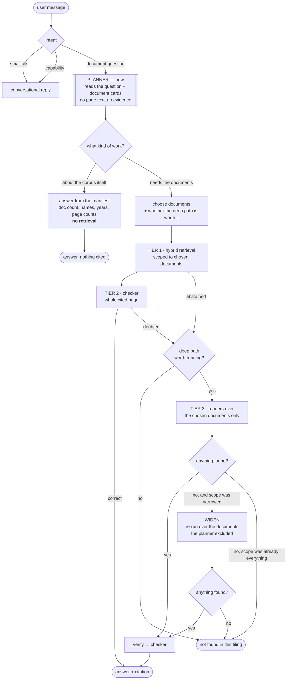

# Planner agent — design proposal

**Status:** proposal, for discussion. Nothing here is implemented.
**Problem:** the harness executes a fixed strategy. It does not decide *how* to
attack a question before attacking it.

---

## 1. The two gaps, measured

Both are real. One of them I introduced earlier today.

### 1a. Deep search reads every document, always

`DocumentCorpus.shards()` iterates `available_documents()` and shards every page
of every document. Nothing between the question and the fan-out looks at *which*
document could possibly hold the answer.

```python
# agent/corpus.py — the whole of the scoping logic today
for doc_name in self.available_documents():
    pages = self.pages_of(doc_name)
    for start in range(0, len(pages), pages_per_shard):
        ...
```

So for a filing set of FY2018 / FY2019 / FY2020 and the question *"What was
total revenue in FY2018?"*:

| | Readers | Wall clock (concurrency 8) | Cost |
|---|---:|---:|---:|
| Today — all three documents | **39** | ~5 waves | 3× |
| Scoped to FY2018 | **13** | ~2 waves | 1× |

Two thirds of that work cannot possibly contain the answer. Measured on the
filing sets actually loaded here:

```text
ACTIVISION         1 doc   126 pages   13 readers per escalated question
Boeing 2022        1 doc   189 pages   19 readers per escalated question
VERIZON_2022_10K   1 doc   115 pages   12 readers per escalated question
```

Single-document sets hide the problem entirely. It appears the moment a filing
set holds a year range — which is the case the product was built for: *"a
question is rarely about one file"*.

### 1b. Questions about the corpus are answered by searching the corpus

*"How many docs have you provided?"* needs no retrieval, no readers and no
verifier. It needs the collection manifest.

Measured, on the live router:

| Message | Routes to | Correct? |
|---|---|---|
| `how many docs?` | `capability` | ✅ (via a model call) |
| `list the documents` | `capability` | ✅ (via a model call) |
| `which years are covered by these filings` | `capability` | ✅ (via a model call) |
| `how many 10-K documents are loaded here` | **`document_question`** | ❌ |
| `how many pages does this filing have` | **`document_question`** | ❌ |

The two failures are **caused by the routing short-circuit I added earlier
today** to take a 25-second model call off the critical path:

- `how many 10-K documents are loaded here` — eight words, and `10-K` contains a
  digit. Both are document-question signals.
- `how many pages does this filing have` — `filing` is in the finance-term list.

That optimisation was worth making and it was too blunt. A message can carry
every signal of a document question and still be a question *about* the corpus
rather than *from* it. The heuristic has no way to tell, and neither does the
prompt-based classifier reliably — it gets these right today and it is one
sampling away from not.

**These are the same gap.** Both are the system failing to decide what kind of
work a question needs before doing the work.

---

## 2. What a planner is, and is not

**Is:** one cheap step that looks at the question and the filing set and decides
*what to run* — answer from metadata, search one document, search all of them,
skip the deep path entirely.

**Is not:** a re-ranker, a retriever, or anything that touches evidence. It never
sees page text and never proposes an answer. It narrows the search space; the
existing tiers still do the work and the deterministic verifier still has the
last word.

### The central risk, stated first

**A planner that scopes wrongly is worse than no planner.**

Today's fan-out is expensive and has no recall ceiling: the answer is in the
document, so some reader will see it. A planner that picks FY2019 when the answer
is in FY2018 makes the answer **unreachable** — and the rubric charges for that:
a missed answer is 0, and an answer read confidently from the wrong year is
**−1**.

The measured history of this project is a warning here. The first cut of the
harness scored **−1 against the fast path's +2** because it answered more and
abstained less. Anything that narrows the search must be assumed to narrow it
wrongly sometimes, and must be designed around that.

So the planner gets one non-negotiable property:

> **Scoping is a hypothesis, not a commitment.** If the scoped search finds
> nothing, the search widens automatically before the system abstains.

That turns a wrong scope into *lost time* instead of *a lost answer*.

---

## 3. Proposed flow



The two new decisions are `what kind of work?` and `choose documents`. Everything
below them is the pipeline that exists today.

---

## 4. The pieces

### 4a. Document cards — the planner's input

The planner cannot choose documents it knows nothing about. Today a collection
manifest holds only this per document:

```json
{"doc_name": "3M_2018_10K", "source_file": "...", "source_format": "html",
 "segment_count": 131, "added_at": 1787...}
```

No company, no fiscal year, no period, no document type. So a planner would have
to guess from the filename — which is user-controlled and often wrong.

Proposal: extract a small **document card** once, at index time, and store it on
the manifest.

```json
{"doc_name": "3M_2018_10K",
 "company": "3M Company",
 "fiscal_year": 2018,
 "period": "FY2018",
 "doc_type": "10-K",
 "period_covered": ["2018", "2017", "2016"],
 "segment_count": 131}
```

`period_covered` matters more than it looks: a 2019 10-K carries **three years**
of income statement and cash flow columns. A planner that scopes *"FY2017
revenue"* to a document named `..._2019_10K` is right, and one that reasons only
from `fiscal_year: 2019` is wrong. This field is why the Activision three-year
average worked at all.

Cost: one cheap call per document at index time, cached forever. Indexing already
takes minutes; this is noise. Regex on the filename can seed it and the first
page can confirm it.

### 4b. What the planner decides

| Decision | Values | Consequence |
|---|---|---|
| `kind` | `corpus_meta` \| `document` | Skip retrieval entirely, or proceed |
| `documents` | subset of the filing set | What tier 1 and tier 3 may look at |
| `confidence` | low \| high | Low confidence ⇒ do not narrow at all |
| `deep_path` | worth it \| not | Whether an abstention should escalate |

### 4c. Where it runs

**After the router, before tier 1.** One call, on the critical path, so it has to
be cheap — the document cards are small and the question is short, so it is a
few hundred tokens either way.

It should be skippable by heuristic exactly as routing now is:

- one document in the filing set ⇒ **nothing to plan**, skip the call entirely
- the question names a year that exactly one card covers ⇒ scope without a call

That keeps the common cases free.

---

## 5. Decisions I need from you

**D1. Does the planner scope tier 1 as well, or only tier 3?**
Tier 1 is cheap and cross-document ranking is deliberate — pooling candidates
across documents before normalising is what makes a folder answerable at all
(see [docs/14](14-collections.md)). Narrowing it saves little and risks the
retrieval quality that everything else rests on.
*My recommendation: tier 3 only, at first.* Measure, then decide about tier 1.

**D2. How aggressive should scoping be?**
- **Conservative** — narrow only when the question names a period that exactly
  one card covers. Few questions qualify; near-zero risk.
- **Confident** — narrow whenever the planner is sure, widen on empty.
- **Aggressive** — always pick the single best document first, widen on empty.
*My recommendation: confident, with the widen fallback mandatory.*

**D3. `corpus_meta` — templated answers or an LLM with the manifest?**
A templated answer ("3 documents: A, B, C") cannot be wrong but cannot handle
"which years do these cover?". Handing the manifest to the conversational
responder handles any phrasing but can miscount.
*My recommendation: give the responder the manifest as structured facts and
forbid it from computing — counts and lists come pre-computed in the prompt.*

**D4. Do I fix the routing heuristic now or fold it into the planner?**
The two misroutes above are live. A counter-signal list (`how many documents`,
`which years`, `list the`, `how many pages`) is a ten-line fix that stops the
bleeding today. The planner subsumes it later.
*My recommendation: fix it now, separately. It is a bug, not a feature gap.*

**D5. Does a wrong scope ever get to abstain without widening?**
Widening doubles the worst-case latency of an unanswerable question — 39 readers
after 13. The alternative is abstaining on a question whose answer is present.
*My recommendation: always widen. An abstention we could have answered is the
expensive kind of wrong.*

---

## 6. How we would know it worked

The planner is a **cost** optimisation with a **correctness** risk, so it needs
both measured, and the correctness one first.

| Metric | Target | Why |
|---|---|---|
| Rubric score on the practice key | **unchanged or better** | The gate. A planner that saves tokens and loses a mark is a regression. |
| Readers per escalated question | down | The point. |
| Widen rate | low | High means the scoping is guessing. |
| Answers rescued by widening | should be **> 0** | If never, the fallback is untested rather than unnecessary. |
| `corpus_meta` questions reaching retrieval | **0** | Gap 1b closed. |

A multi-document filing set is needed to measure any of this — every set loaded
here today has one document, which is precisely why the gap went unnoticed.
Building a 3M 2018/2022/2023Q2 set from the corpus is the first task.

---

## 7. What could go wrong

| Risk | Mitigation |
|---|---|
| Wrong document chosen, answer lost | Mandatory widen on empty |
| Wrong document chosen, answer found in the wrong year | **The real danger.** Same figure, wrong period — the verifier cannot see it, since every digit traces. The checker's period rule is the only guard, and it is a prompt. |
| Planner adds a call to every question | Heuristic skips: one document, or an unambiguous period match |
| Document cards wrong | Seed from filename, confirm from page one, and never let a card *exclude* a document on its own — only rank it lower |
| Another tier, another thing to go wrong | It is the fourth model in a chain. Worth asking whether the token saving justifies that before building it. |

The second row is the one to think hardest about. It is the failure mode the
harness already has — three of the current −1s are wrong-period or wrong-scope
answers — and a planner that narrows to the wrong document makes it *more* likely,
not less.

---

## 8. My honest read

Gap 1b (`corpus_meta`) is worth fixing regardless, is cheap, and carries no
correctness risk. I would do it whether or not we build a planner.

Gap 1a (document scoping) is a real 3× cost on multi-document sets, and the
saving is genuine. But it buys **cost, not accuracy**, and every previous change
in this project that traded correctness for reach cost more than it gained. I
would build it behind a setting, measure the rubric first and the tokens second,
and be prepared to leave it off.

The order I would propose:

1. Fix the routing misroutes (a bug, today)
2. Build a multi-document filing set (needed to measure anything)
3. Document cards at index time (useful on their own — the UI can show them)
4. `corpus_meta` answered from the manifest
5. Document scoping for tier 3, behind a setting, with mandatory widen
6. Measure the rubric, then the tokens
