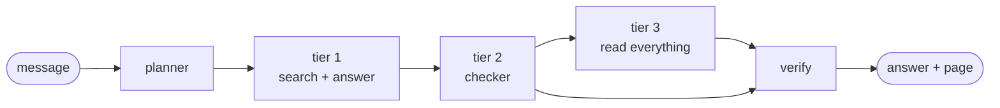

# Documentation

Guides for what is built. For what is left to do, see [`../PLAN.md`](../PLAN.md).

**New here?** Read [what changed and what it measured](17-enhancements.md) first.
It is the map.

## How a question is answered

| Doc | What it covers |
|---|---|
| **[What changed](17-enhancements.md)** | **Start here.** Every change, what it fixed, what it measured |
| [The planner](20-planner-agent.md) | Deciding what a message needs, and the escape hatches |
| [The agent harness](16-agent-harness.md) | The three tiers, the readers, the tools |
| [Stopping a run](19-stopping-a-run.md) | What it takes to actually stop work in a worker thread |
| [Tier 1: search and answer](09-qa-pipeline.md) | Retrieve, ask, verify |
| [Finding the right page](07-hybrid-retrieval.md) | How the two searches are blended, with measurements |
| **Reading documents** | |
| [Reading SEC HTML](03-html-parsing.md) | Getting page numbers back out of HTML |
| [Reading any document](13-document-parsing.md) | PDF, Word, Excel, CSV → Markdown pages |
| [Filing sets](14-collections.md) | Many documents, one question, one citation |
| **The searches** | |
| [Word search](05-bm25-retrieval.md) | BM25, and what it is actually worth here |
| [Meaning search](06-vector-retrieval.md) | Embeddings, and the truncation limit |
| [Embeddings client](04-embeddings.md) | Talking to the embedding provider |
| [Building indexes](08-indexing-services.md) | Parse, build, save, reload |
| **Running it** | |
| [Project setup](01-project-setup.md) | Install, tests, demos |
| [Configuration](02-configuration.md) | Every setting and what it does |
| [Running the stack](15-docker.md) | Docker: api, ui, database |
| [The HTTP API](11-api.md) | Endpoints, streaming, errors |
| [The design system](18-design-system.md) | Colours, and why colour means something |
| **Judging it** | |
| [Evaluation](10-evaluation.md) | Answer the practice questions and grade them |
| [Why we fan out](12-multi-agent-retrieval.md) | The analysis that led to tier 3 |
